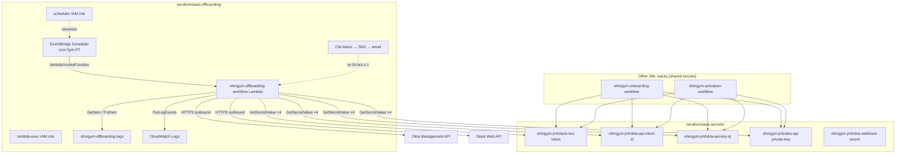
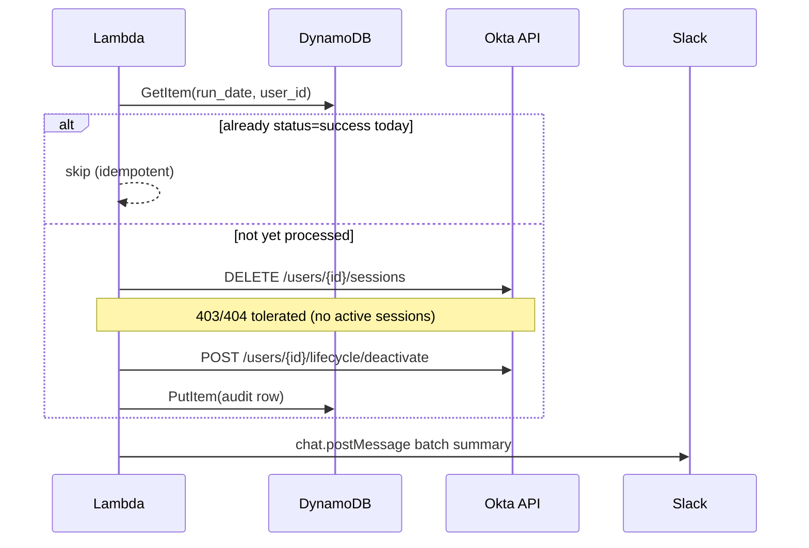

# Ohmgym Offboarding Workflow — Scheduled AWS → Okta → Slack Deactivation

The **proactive leaver** half of the JML pipeline. Every day at **5:00 PM America/Los_Angeles**, EventBridge Scheduler invokes a Lambda that queries Okta for users whose `(status == ACTIVE or PROVISIONED) and profile.endDate == today_PT`, revokes sessions, deactivates each account, writes audit rows to DynamoDB, and posts one batch summary to `#leaver-it-ops`. SCIM cascades Slack (and GWS for real SCIM users) without code in this Lambda.

Mirror of [10-aws-scheduled-onboarding-workflow.md](10-aws-scheduled-onboarding-workflow.md).

Companion to:
- [07-end-to-end-leaver-demo.md](07-end-to-end-leaver-demo.md) — manual `leaver_workflow.py`
- [05-slack-scim-lifecycle.md](05-slack-scim-lifecycle.md) — SCIM deprovision evidence

This adds **a third Terraform-managed AWS stack** in `terraform/aws-offboarding/`, deployed in **us-west-1** alongside `terraform/aws-secrets/` (shared `ohmgym-jml/*` credentials), `terraform/aws-onboarding/` (proactive joiner), and `ohmgym-activation-workflow` (reactive joiner).

## Purpose

Doc 07 productized the manual `leaver_workflow.py` CLI. This doc closes the production gap: **when do leavers actually get deactivated on their last day without a human running a script?**

The realistic pattern is HR sets `profile.endDate` weeks in advance (notice period, contractor end dates, M&A integration). None of them should be deactivated until that date. Three architectural options for the trigger:

1. **Poll Okta from a long-running watcher process.** Couples scheduling to a host that has to stay up; breaks if the laptop closes.
2. **Okta Workflows scheduled flow.** Production-grade for shops that live in the Okta console, but introduces a SaaS dependency and isn't config-as-code. Explicitly out of scope for this repo.
3. **EventBridge Scheduler → AWS Lambda → Okta + Slack** ← chose this. Native AWS primitives, deployed-as-code via Terraform, observable in CloudWatch, scoped IAM, secrets in Secrets Manager. Mirrors the doc-10 onboarding architecture with inverted lifecycle semantics (deactivate instead of activate).

## Topology

```
┌────────────────────────────────────────────────────────────────────────────────┐
│                                                                                  │
│  EventBridge Scheduler  (us-west-1)                                              │
│    name:     ohmgym-offboarding-workflow                                         │
│    cron:     cron(0 17 * * ? *)                                                  │
│    tz:       America/Los_Angeles                                                 │
│    target:   aws_lambda_function.offboarding_workflow                            │
│       │                                                                          │
│       │  5:00 PM PT every day                                                    │
│       ▼                                                                          │
│  AWS Lambda  ohmgym-offboarding-workflow  (Python 3.12, 512 MB, 60s)             │
│       │                                                                          │
│       ├─► Secrets Manager (us-west-1 ohmgym-jml/*) × 4 — at cold start          │
│       │     slack-bot-token, okta-api-client-id,                                 │
│       │     okta-api-key-id, okta-api-private-key                                │
│       │                                                                          │
│       ├─► today_pt = datetime.now(ZoneInfo("America/Los_Angeles")).date()        │
│       │     (override via event["override_date"] for the replay CLI)             │
│       │                                                                          │
│       ├─► GET https://<okta>/api/v1/users                                        │
│       │     ?search=(status eq "ACTIVE" or status eq "PROVISIONED")              │
│       │            and profile.endDate eq "<today_pt>"                           │
│       │     &limit=200                                                           │
│       │                                                                          │
│       ├─► for each matched user:                                                 │
│       │     DynamoDB GetItem (run_date, user_id) → skip if status=success        │
│       │     DELETE /api/v1/users/{id}/sessions  (security-critical, first)       │
│       │     POST /api/v1/users/{id}/lifecycle/deactivate                         │
│       │     DynamoDB PutItem with full identity snapshot                         │
│       │       (login, first_name, last_name, department, role_title,             │
│       │        start_date [= endDate], status, okta_response_status,             │
│       │        error_message, timestamp_utc, batch_run_id, ttl_epoch=now+90d)    │
│       │     time.sleep(0.2)  # Okta rate-limit pacing                            │
│       │                                                                          │
│       ├─► Slack chat.postMessage → #leaver-it-ops                                │
│       │     🚪 Daily leaver deactivations — <run_date>                          │
│       │     • First Last — role, department (login) [per deactivated user]      │
│       │     • Errors / Skipped sections (conditional)                            │
│       │     • Context footer with batch_run_id                                   │
│       │                                                                          │
│       └─► CloudWatch Logs: /aws/lambda/ohmgym-offboarding-workflow               │
│             └─► structured JSON line for each user + final summary line          │
│                                                                                  │
│  CloudWatch Alarm                                                                │
│    metric: AWS/Lambda Errors, period 5m, threshold ≥ 1                           │
│    action: SNS topic → email (failure only; success posts to Slack)              │
│                                                                                  │
│  ─── downstream (no code in this Lambda) ───                                   │
│  Okta SCIM → Slack user_deactivated within ~3s of Okta deactivation.            │
│  GWS SCIM cascade for real (non-alias) SCIM users.                               │
│                                                                                  │
└────────────────────────────────────────────────────────────────────────────────┘
```

## Terraform stack layout

Everything lives in **us-west-1**. Three independent Terraform roots cooperate:



| Stack | Purpose | Offboarding uses |
|---|---|---|
| `terraform/aws-secrets/` | Creates 5 `ohmgym-jml/*` secrets | 4 of 5 (not `okta-webhook-secret`) |
| `terraform/aws-offboarding/` | Scheduler + Lambda + DDB + alarms | This workflow |
| `terraform/aws-onboarding/` | Proactive joiner (9 AM) | Separate; mirror architecture |
| `terraform/aws/` | Reactive activation hook | Separate; not in offboarding path |

Secret ARNs are passed into `aws-offboarding` via `terraform.tfvars` (gitignored). The Lambda receives **secret names** as environment variables and resolves values at cold start.

## What's in `terraform/aws-offboarding/`

```
terraform/aws-offboarding/
├── .gitignore               # state, *.tfvars (real values), build artifacts
├── providers.tf             # aws ~> 5.70; region = us-west-1; default tags
├── variables.tf             # 18 inputs (4 sensitive: secret ARNs + alarm email)
├── dynamodb.tf              # ohmgym-offboarding-logs table
├── iam.tf                   # Lambda exec role + 3 scoped policies + scheduler role + invoke policy
├── lambda.tf                # log group + function + scheduler-invoke permission
├── scheduler.tf             # aws_scheduler_schedule.daily (5pm PT cron)
├── alarms.tf                # SNS topic + email sub + CW metric alarm
├── outputs.tf               # 7 outputs (function name/arn, log group, table, scheduler arn, sns arn, role arn)
├── terraform.tfvars         # GITIGNORED — real values
└── terraform.tfvars.example # committed template
```

**13 new AWS resources** in us-west-1. Shared secrets live in `terraform/aws-secrets/` (`ohmgym-jml/*` prefix, single region).

## End-to-end invocation trace

### 1. EventBridge Scheduler fires

`aws_scheduler_schedule.daily` in [`scheduler.tf`](../terraform/aws-offboarding/scheduler.tf):

- **Cron:** `cron(0 17 * * ? *)` + `America/Los_Angeles` (DST-safe; no manual UTC math)
- **Target:** `ohmgym-offboarding-workflow` Lambda ARN
- **Retries:** `maximum_retry_attempts = 0` on the scheduler side — recovery is the replay CLI + DynamoDB idempotency guard

**Permission chain:**

1. Scheduler service assumes `ohmgym-offboarding-workflow-scheduler` role
2. That role has exactly `lambda:InvokeFunction` on this one Lambda ARN
3. `aws_lambda_permission.allow_scheduler` grants `scheduler.amazonaws.com` from this schedule's ARN

No Function URL — no public HTTP surface. Only Scheduler and manual `aws lambda invoke` (replay CLI) can trigger it.

### 2. Lambda cold start — Secrets Manager

On first load, the handler creates a boto3 Secrets Manager client and fetches four secrets **by name** (not ARN):

```python
_secrets_client = boto3.client("secretsmanager", region_name=SECRETS_REGION)
_SLACK_BOT_TOKEN = _fetch_secret(SLACK_BOT_TOKEN_SECRET_NAME)
_OKTA_API_CLIENT_ID = _fetch_secret(OKTA_API_CLIENT_ID_SECRET_NAME)
_OKTA_API_PRIVATE_KEY = _fetch_secret(OKTA_API_PRIVATE_KEY_SECRET_NAME)
_OKTA_API_KEY_ID = _fetch_secret(OKTA_API_KEY_ID_SECRET_NAME)
```

Environment variables are wired in [`lambda.tf`](../terraform/aws-offboarding/lambda.tf): secret names, `OKTA_ORG_URL`, `DYNAMODB_TABLE_NAME`, `SLACK_TEAM_ID`, `LEAVER_CHANNEL_NAME`.

**IAM** ([`iam.tf`](../terraform/aws-offboarding/iam.tf)): `secretsmanager:GetSecretValue` scoped to exactly the four secret ARNs (with and without the Secrets Manager version suffix). The Lambda role **cannot** read `ohmgym-jml/okta-webhook-secret` (activation hook only). No `kms:Decrypt` — secrets are plain strings.

### 3. Okta auth — Private Key JWT (outbound HTTPS)

The Lambda signs a JWT with the private key from Secrets Manager and exchanges it at `POST {OKTA_ORG_URL}/oauth2/v1/token`:

- **Grant:** `client_credentials` with `client_assertion_type=jwt-bearer`
- **Scopes:** `okta.users.read okta.users.manage`
- **Cache:** access token held in-memory for warm invocations

This is **outbound HTTPS** from Lambda to Okta. AWS IAM does not gate it — Okta authorizes based on the API Services app.

### 4. Okta search — who gets offboarded today?

```
search=(status eq "ACTIVE" or status eq "PROVISIONED") and profile.endDate eq "<today_pt>"
```

| Step | Okta API | Scope | When |
|---|---|---|---|
| Search | `GET /api/v1/users?search=...` | `okta.users.read` | Once per batch |
| Revoke sessions | `DELETE /api/v1/users/{id}/sessions` | `okta.users.manage` | Per matched user |
| Deactivate | `POST /api/v1/users/{id}/lifecycle/deactivate` | `okta.users.manage` | Per matched user |

`today_pt` is computed in `America/Los_Angeles` (or overridden via `event.override_date` for replays).

`profile.endDate` is a custom attribute (defined in `config/okta/desired-state.json`), so the server-side `search` filter is required — the legacy `filter=` parameter cannot query custom profile fields.

If the search HTTP call fails, the handler logs `okta_search_failed` and **re-raises** — Lambda records an error → CloudWatch alarm → SNS email.

### 5. Per-user processing loop



**Security ordering** (matches `leaver_workflow.py`): revoke sessions **before** deactivate so existing tokens cannot be replayed. HTTP 403/404 on session revoke is tolerated (user may have no active sessions).

**DynamoDB IAM:** only `GetItem` + `PutItem` on `ohmgym-offboarding-logs`. Idempotency: if `(run_date, user_id)` already has `status=success`, skip. Safe for replays and same-day re-runs.

**Downstream SCIM** — not in this Lambda. Okta deactivation triggers SCIM DELETE to Slack (~3s) automatically via existing Okta app provisioning.

### 6. Slack notification (outbound HTTPS)

Uses the bot token from Secrets Manager. Calls `conversations.create` (idempotent) then `chat.postMessage` to `#leaver-it-ops`. No AWS IAM involved — Slack authorizes the `xoxb-` token.

### 7. Observability and notifications

| Signal | Path | Success run | Failure |
|---|---|---|---|
| Structured logs | CloudWatch `/aws/lambda/ohmgym-offboarding-workflow` | `offboarding_batch_complete` JSON | `okta_search_failed` + stack trace |
| Audit trail | DynamoDB `ohmgym-offboarding-logs` | Row per user | Row with `status=error` |
| Operator notification | Slack `#leaver-it-ops` | Batch summary (even if 0 users) | Batch summary lists errors |
| Email | SNS via CW alarm | **Nothing** | Email if Lambda Errors ≥ 1 |

Email is **failure-only**. A clean 5 PM run (including `deactivated_count: 0`) posts to Slack but does not trigger SNS.

## IAM permission matrix

Two principals, two roles. No AWS managed policy attachments — all inline and resource-scoped.

| Principal | Assumes | Can do | Cannot do |
|---|---|---|---|
| **Scheduler role** (`ohmgym-offboarding-workflow-scheduler`) | `scheduler.amazonaws.com` | `lambda:InvokeFunction` on offboarding Lambda only | Read secrets, touch DDB, invoke other Lambdas |
| **Lambda exec role** (`ohmgym-offboarding-workflow-lambda-exec`) | `lambda.amazonaws.com` | `logs:PutLogEvents` on its log group; `secretsmanager:GetSecretValue` on 4 secrets; `dynamodb:GetItem/PutItem` on offboarding table | `dynamodb:Scan`, other secrets, `lambda:Invoke`, VPC, S3, etc. |
| **Lambda (runtime)** | — | Outbound HTTPS to Okta + Slack | Inbound HTTP (no Function URL) |

## Offboarding vs onboarding

| | Offboarding (5 PM) | Onboarding (9 AM) |
|---|---|---|
| Search filter | `ACTIVE\|PROVISIONED` + `endDate == today` | `STAGED\|DEPROVISIONED` + `startDate == today` |
| Lifecycle call | `POST .../deactivate` | `POST .../activate?sendEmail=true` |
| Pre-step | Revoke sessions | None |
| DynamoDB table | `ohmgym-offboarding-logs` | `ohmgym-onboarding-logs` |
| Slack channel | `#leaver-it-ops` | `#joiner-it-ops` |
| Terraform root | `terraform/aws-offboarding/` | `terraform/aws-onboarding/` |
| Handler | [`lambdas/offboarding_workflow/handler.py`](../lambdas/offboarding_workflow/handler.py) | [`lambdas/onboarding_workflow/handler.py`](../lambdas/onboarding_workflow/handler.py) |

Same 4 secrets, same JWT auth pattern, same scheduler/Lambda/IAM shape.

## What Terraform does NOT manage

These are operator/Okta-console concerns outside `aws-offboarding`:

- **`profile.endDate`** custom attribute — `config/okta/desired-state.json` + `reconcile_config.py --apply`
- **Okta API Services app** — client ID, key ID, private key (values stored in `aws-secrets`)
- **SCIM app assignments** — Okta → Slack provisioning (pre-existing)
- **Slack channel** — Lambda creates `#leaver-it-ops` at runtime if missing

## Repo layout

| Path | Role |
|---|---|
| [`lambdas/offboarding_workflow/`](../lambdas/offboarding_workflow/) | Lambda handler + tests |
| [`terraform/aws-offboarding/`](../terraform/aws-offboarding/) | us-west-1 stack |
| [`scripts/offboarding/`](../scripts/offboarding/) | CLI helpers (see README there) |
| [`config/okta/desired-state.json`](../config/okta/desired-state.json) | `profile.endDate` attribute |

## Okta search

```
search=(status eq "ACTIVE" or status eq "PROVISIONED") and profile.endDate eq "<today_pt>"
```

## Phased demo (Alex Novak + Jordan Kim)

### Phase 1 — Manual offboard (completed 2026-05-27)

```bash
# Schema + endDate (operator; once per tenant)
python scripts/okta/reconcile_config.py --apply   # needs okta.schemas.manage

python scripts/offboarding/set_end_date.py --name "Alex Novak"
python scripts/offboarding/set_end_date.py --name "Jordan Kim"
python scripts/offboarding/invoke_offboarding_workflow.py
```

**Result:** `deactivated_count: 2`, DynamoDB rows in `ohmgym-offboarding-logs`, Slack batch in `#leaver-it-ops` (channel `C0B1KV5CS4Q`).

### Phase 2 — Re-onboard (completed 2026-05-27)

```bash
python scripts/offboarding/restage_for_onboarding.py --name "Alex Novak" --name "Jordan Kim"
python scripts/onboarding/invoke_onboarding_workflow.py --tail-logs
```

**Result:** `activated_count: 2`, `#joiner-it-ops` batch summary. Onboarding Lambda search includes `DEPROVISIONED` (in addition to `STAGED`) so leaver round-trips work after `restage_for_onboarding.py`.

### Phase 3 — Scheduled offboard

Set `profile.endDate` to a future PT date; wait for 5:00 PM scheduler (do not manual invoke).

## DynamoDB audit schema

Same keys as onboarding: `run_date` (PK), `user_id` (SK). The `start_date` attribute stores `profile.endDate` at deactivation time for schema parity with the onboarding table.

| Attribute | Type | Notes |
|---|---|---|
| `run_date` | String (PK) | YYYY-MM-DD in America/Los_Angeles |
| `user_id` | String (SK) | Okta user id; per-(date, user) idempotency |
| `login` | String | profile.login |
| `first_name`, `last_name` | String | profile.firstName, profile.lastName |
| `department`, `role_title` | String | profile.department, profile.role_title |
| `start_date` | String | profile.endDate at deactivation time (naming parity) |
| `status` | String | `success` \| `error` |
| `okta_response_status` | Number | HTTP status from deactivate POST |
| `error_message` | String | Okta `errorSummary` when status=error |
| `timestamp_utc` | String | ISO 8601 UTC of the attempt |
| `batch_run_id` | String | UUID correlating to CloudWatch log lines |
| `ttl_epoch` | Number | Unix seconds; auto-purged after ~90 days |

## Tests

`lambdas/offboarding_workflow/tests/` mirrors the onboarding suite: search URL construction, `override_date`, session revoke + deactivate ordering, DynamoDB idempotency, error paths, Slack Block Kit shape, JWT token caching, and Okta search failure propagation (so the alarm fires).

All AWS calls go through `moto`. Okta + Slack HTTP through `requests_mock`. No live network.

## CI/CD

`.github/workflows/offboarding-workflow-ci.yml` and `.github/workflows/jml-west-migration-ci.yml` run pytest, `build.sh`, and `terraform fmt/validate` on pushes to `main`. **Apply stays operator-gated** — CI never runs `terraform apply` or `aws lambda invoke`.

## Links

- [`lambdas/offboarding_workflow/handler.py`](../lambdas/offboarding_workflow/handler.py) — the Lambda
- [`lambdas/offboarding_workflow/tests/test_handler.py`](../lambdas/offboarding_workflow/tests/test_handler.py) — pytest cases
- [`terraform/aws-offboarding/`](../terraform/aws-offboarding/) — the us-west-1 stack
- [`terraform/aws-secrets/`](../terraform/aws-secrets/) — shared `ohmgym-jml/*` secrets
- [`scripts/offboarding/README.md`](../scripts/offboarding/README.md)
- [`.github/workflows/offboarding-workflow-ci.yml`](../.github/workflows/offboarding-workflow-ci.yml)
