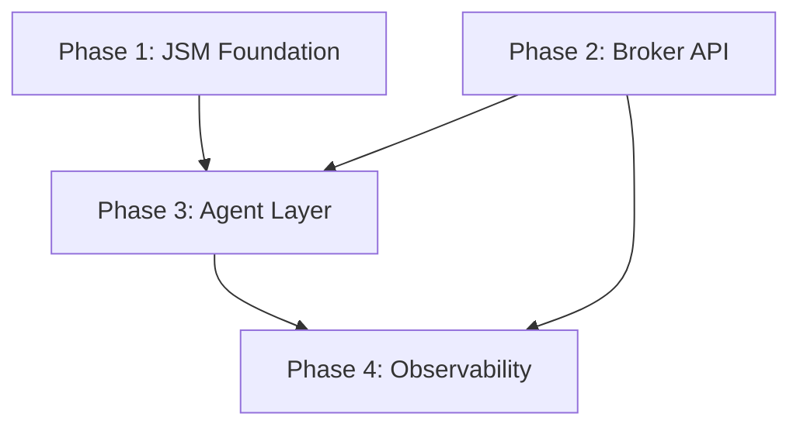

# Access Review Broker Agent — Product Requirements Document

Ticket-driven access provisioning for NovaTech Solutions: employees submit access requests via the **Jira Service Management (JSM) Customer Portal**, an AI agent triages and validates against **Okta** (read-only), and a least-privileged **broker API** grants **Okta group membership** after approval. Every grant produces a three-way audit trail (Jira ticket, DynamoDB, Okta System Log).

**Architecture variant:** Option B — agent-assisted triage with deterministic writes through the broker API. The agent never holds Okta write credentials.

**Linear project:** [Access Review Broker Agent](https://linear.app/it-systems-sandbox/project/access-review-broker-agent-653f022f3168)

Companion to:
- [04-okta-migration.md](04-okta-migration.md) — Okta IdP foundation and `access-*` group convention
- [08-okta-event-hook-lambda.md](08-okta-event-hook-lambda.md) — Lambda + CloudWatch + Secrets Manager pattern for broker
- [12-grc-jml-audit-access.md](12-grc-jml-audit-access.md) — GRC read-only audit access pattern (extend for access grants)

---

## Problem statement

IT-Ops receives ad-hoc access requests via Slack DMs and email. Grants are manual, inconsistently documented, and hard to audit. NovaTech needs:

1. **Self-service intake** with structured entitlement selection (not free-text group names)
2. **Approval workflow** before any access change
3. **Least-privilege automation** — a dedicated broker identity, not human admin credentials or LLM write access to Okta
4. **Observability** — queryable audit history for GRC and IT-Ops

This project mirrors Enterprise SaaS Platform Engineering responsibilities: IdP group governance, ticket-driven workflows, Python/API automation, and AI agents with bounded tool access.

---

## Goals

| Goal | Success metric |
|------|----------------|
| Structured access intake | 100% of grants originate from JSM Access Request tickets with dropdown entitlement |
| Approval before grant | Zero broker writes without `Approved` Jira status |
| Least-privilege broker | Dedicated Okta API app scoped to group membership only |
| Agent read / broker write split | Agent uses Okta MCP read-only; broker API is sole write path |
| Audit trail | Every grant has `correlation_id = JIRA-{issue_key}` in Jira, DynamoDB, and CloudWatch |
| Time-bound access (stretch) | `expires_at` stored; scheduled revoke job removes group membership |

---

## Non-goals (v1)

- Okta metadata sync into Jira (runtime Okta reads only)
- SCIM/SAML federation between Okta and Jira
- JSM portal form configuration via MCP or Terraform (UI-first in JSM Admin)
- LLM direct calls to Okta group membership APIs
- User account deactivation on revoke (remove group membership only; preserve audit trail)
- Provisioning downstream apps beyond Okta group assignment (GWS/Slack cascade is Okta's job)

---

## Personas

| Persona | Role | Interaction |
|---------|------|-------------|
| **Employee** | Access requester | JSM Customer Portal — submits Access Request |
| **Manager** | Approver | Jira approval workflow |
| **IT-Ops agent (human)** | Escalation / override | Jira queue, Slack `#it-ops-alerts` on broker failure |
| **Access broker (machine)** | Write executor | Lambda + dedicated Okta API Services app |
| **AI agent (Cursor)** | Triage / validation | Jira MCP + Okta MCP read → broker API write |
| **GRC analyst** | Audit consumer | DynamoDB read (future: extend `ohmgym-grc-jml-audit-read` pattern) |

---

## Architecture

```
┌─────────────────────────────────────────────────────────────────────────────┐
│  Employee                                                                    │
│       │                                                                      │
│       ▼                                                                      │
│  JSM Customer Portal  ──►  Access Request ticket (structured fields)        │
│       │                                                                      │
│       ▼                                                                      │
│  Manager approval  (Jira workflow — manual config in Phase 1)               │
│       │                                                                      │
│       ▼                                                                      │
│  Jira Automation webhook  ──►  Agent runner (Phase 3)                       │
│       │                           │                                          │
│       │                           ├── Jira MCP: read ticket, post comment    │
│       │                           ├── Okta MCP: read user, group membership  │
│       │                           └── Broker API: POST /v1/access/grant      │
│       ▼                                                                      │
│  Broker (Lambda Function URL)                                                │
│       │  • Allowlist: config/access/entitlements.json                        │
│       │  • Private Key JWT → Okta Management API                             │
│       │  • Secrets Manager for creds                                         │
│       ▼                                                                      │
│  Okta  ──►  group.user_membership.add  ──►  SCIM/SAML cascade (GWS, Slack)  │
│       │                                                                      │
│       ▼                                                                      │
│  Observability: Jira comment + DynamoDB row + CloudWatch JSON + Okta log     │
└─────────────────────────────────────────────────────────────────────────────┘
```

### Architectural decisions (ADRs)

| ID | Decision | Rationale |
|----|----------|-----------|
| ADR-001 | Jira = workflow + audit; Okta = identity + enforcement | Separation of concerns; Jira is not the authorization layer |
| ADR-002 | Broker API is the only write path | Okta API scopes are too broad for LLM tools; allowlist enforced in code |
| ADR-003 | Entitlement dropdown in Jira, not free text | Prevents agent/broker from interpreting ambiguous group names |
| ADR-004 | No Okta → Jira metadata sync | Agent reads Okta at runtime; simpler sandbox, fewer moving parts |
| ADR-005 | Revoke = remove group membership, not deactivate user | Preserves audit trail; matches leaver ADR in JML project |
| ADR-006 | Dry-run by default on broker CLI | Matches repo convention (`reconcile_config.py --dry-run`) |

---

## Data model

### JSM ticket fields (Phase 1 — configured in Admin UI)

| Field | Type | Maps to |
|-------|------|---------|
| Entitlement | Dropdown | Key in `config/access/entitlements.json` |
| Business justification | Paragraph | Audit only |
| Duration | Dropdown (30/60/90/permanent) | `expires_at` in DynamoDB |

### Entitlement allowlist (`config/access/entitlements.json`)

```json
{
  "salesforce-readonly": {
    "okta_group_name": "access-salesforce-ro",
    "jira_field_value": "Salesforce (Read Only)",
    "requires_it_approval": false,
    "max_duration_days": 90,
    "allowed_departments": ["Sales", "Marketing"]
  }
}
```

### DynamoDB audit row (`ohmgym-access-audit`)

| Attribute | Example |
|-----------|---------|
| `correlation_id` | `JIRA-IT-42` |
| `requester_email` | `alice@ohmgym.com` |
| `entitlement_key` | `salesforce-readonly` |
| `okta_group_id` | `00gabc...` |
| `action` | `grant` / `revoke` |
| `status` | `success` / `denied` / `failed` |
| `approver` | `manager@ohmgym.com` |
| `granted_at` | ISO timestamp |
| `expires_at` | ISO timestamp or null |
| `okta_system_log_uuid` | Link back to Okta |
| `agent_id` | `access-broker-v1` |

### Broker API contract

**`POST /v1/access/grant`**

```json
{
  "correlation_id": "JIRA-IT-42",
  "requester_email": "alice@ohmgym.com",
  "entitlement_key": "salesforce-readonly",
  "approved_by": "manager@ohmgym.com",
  "approved_at": "2026-07-02T22:00:00Z"
}
```

**`POST /v1/access/revoke`** — same shape; used by scheduled expiry job.

---

## MCP tool boundaries

| Tool | Read | Write | Phase |
|------|------|-------|-------|
| **Atlassian Rovo MCP** | Ticket fields, JQL queue, field metadata | Comments, transitions, test issues | 1, 3 |
| **Okta MCP** | Users, groups, membership | ❌ None | 3 |
| **Broker API** | Status endpoint | Grant/revoke only | 2, 3 |
| **Linear MCP** | Roadmap tracking | Issue management | Ongoing |

**JSM Admin (portal, request types, approvals):** not available via MCP — manual UI in Phase 1.

---

## Phase 1 — JSM Foundation

**Target:** 2026-07-09  
**Linear milestone:** Phase 1 — JSM Foundation  
**Epic:** [IT-20](https://linear.app/it-systems-sandbox/issue/IT-20/phase-1-jsm-foundation-epic)

### Objective

Users can submit access requests via the JSM Customer Portal. Approval workflow works. No Okta integration yet.

### Requirements

| ID | Requirement | Linear | Owner |
|----|-------------|--------|-------|
| P1-R1 | JSM project with **Access Request** request type visible on Customer Portal | IT-6 | Manual (JSM Admin) |
| P1-R2 | Portal form: Entitlement (dropdown), Justification (required), Duration (dropdown) | IT-5 | Manual (JSM Admin) |
| P1-R3 | Dropdown values map to entitlement keys — no raw Okta group names in UI | IT-5 | Manual |
| P1-R4 | Manager approval required before ticket reaches provisionable state | IT-7 | Manual (Jira Automation) |
| P1-R5 | Optional IT-Ops approval for sensitive entitlements | IT-7 | Manual |
| P1-R6 | Jira API token in `.env`: `JIRA_BASE_URL`, `JIRA_EMAIL`, `JIRA_API_TOKEN` | IT-8 | Repo |
| P1-R7 | Document `customfield_*` IDs in `config/jira/field-mapping.json` | IT-8 | Agent + Rovo MCP |
| P1-R8 | Three test tickets submitted via portal and approved manually | IT-20 | Manual QA |

### Exit criteria

- [ ] Portal URL shared; employees can submit without Jira license
- [ ] Approval workflow fires on manager action
- [ ] Field IDs documented for Phase 3 agent
- [ ] Rovo MCP can read test ticket custom fields via `getJiraIssue`

### Deliverables

```
config/jira/field-mapping.json   # customfield IDs (Phase 1 output)
.env                             # JIRA_* credentials (gitignored)
```

---

## Phase 2 — Broker API + Okta Entitlements

**Target:** 2026-07-16  
**Linear milestone:** Phase 2 — Broker API + Okta Entitlements

### Objective

Deterministic grant/revoke path exists. Broker enforces allowlist. No agent yet — test via curl/webhook.

### Requirements

| ID | Requirement | Linear |
|----|-------------|--------|
| P2-R1 | `access-*` groups in `config/okta/desired-state.json`; reconcile via `reconcile_config.py --apply` | IT-12 |
| P2-R2 | `config/access/entitlements.json` maps Jira dropdown → Okta group ID | IT-9 |
| P2-R3 | Dedicated Okta API Services app: `okta.users.read`, `okta.groups.read`, `okta.groupMembership.manage` only | IT-11 |
| P2-R4 | Broker rejects unknown entitlement keys (allowlist enforcement) | IT-10 |
| P2-R5 | Broker checks user exists and is `ACTIVE` before grant | IT-10 |
| P2-R6 | Idempotent grant — skip if already in group | IT-10 |
| P2-R7 | `--dry-run` mode prints plan without Okta writes | IT-10 |
| P2-R8 | Lambda Function URL + Secrets Manager (mirror `okta_activation_handler`) | IT-10 |
| P2-R9 | Webhook auth via shared secret (HMAC or Authorization header) | IT-10 |

### Exit criteria

- [ ] `curl` to broker grants test user to one allowlisted group
- [ ] Unknown entitlement returns 400, no Okta write
- [ ] Dry-run produces accurate plan
- [ ] CloudWatch log line with structured JSON

### Deliverables

```
config/access/entitlements.json
scripts/access/broker.py
lambdas/access_broker/handler.py
terraform/aws/access_broker.tf
```

---

## Phase 3 — Agent Layer

**Target:** 2026-07-23  
**Linear milestone:** Phase 3 — Agent Layer

### Objective

AI agent triages on ticket create; on approval, agent calls broker API. Agent never writes to Okta directly.

### Requirements

| ID | Requirement | Linear |
|----|-------------|--------|
| P3-R1 | On ticket create: read form fields, Okta read (user exists, current groups) | IT-13 |
| P3-R2 | Agent posts recommendation comment; no grant until approved | IT-13 |
| P3-R3 | Jira Automation webhook on `Approved` → agent or broker | IT-15 |
| P3-R4 | Webhook payload: `issue_key`, `entitlement_key`, `requester_email`, `approver` | IT-15 |
| P3-R5 | Okta MCP wired in Cursor; read-only verification | IT-14 |
| P3-R6 | Agent calls `POST /v1/access/grant` — not Okta MCP — on approval | IT-13, IT-15 |
| P3-R7 | Agent updates Jira ticket with grant result + correlation ID | IT-13 |
| P3-R8 | End-to-end: portal → triage → approve → grant → Jira closed | IT-19 |

### Agent tool set

| Tool | Purpose |
|------|---------|
| Atlassian Rovo MCP | Read ticket, post comment, transition status |
| Okta MCP | Read user profile, list groups, check membership |
| Broker API | Grant/revoke after policy checks |

### Exit criteria

- [ ] Three test users across departments complete full flow
- [ ] Denied ticket never triggers broker
- [ ] Jira ticket contains full audit chain

---

## Phase 4 — Observability

**Target:** 2026-07-30  
**Linear milestone:** Phase 4 — Observability

### Objective

Three-way audit trail operational. Failures alert IT-Ops. Weekly metrics report.

### Requirements

| ID | Requirement | Linear |
|----|-------------|--------|
| P4-R1 | DynamoDB table `ohmgym-access-audit` with TTL (90 days) | IT-16 |
| P4-R2 | Broker writes audit row on every grant/revoke attempt | IT-16 |
| P4-R3 | CloudWatch structured JSON; `correlation_id = JIRA-{issue_key}` | IT-17 |
| P4-R4 | Slack `#it-ops-alerts` on broker failure (mirror activation Lambda) | IT-17 |
| P4-R5 | Jira internal comment links Okta System Log UUID | IT-17 |
| P4-R6 | `scripts/reports/access_request_report.py` — approval rate, median time-to-grant | IT-18 |
| P4-R7 | GRC read-only DynamoDB access (extend `terraform/aws-grc-audit/`) | Future |

### Exit criteria

- [ ] GRC-style query returns all grants for a date range
- [ ] Failed grant posts to Slack within 60 seconds
- [ ] Weekly report runs locally against DynamoDB + Jira API

### Deliverables

```
terraform/aws/access_audit.tf
scripts/reports/access_request_report.py
scripts/access/revoke_expired.py          # scheduled cleanup (stretch)
```

---

## Security requirements (all phases)

| Control | Implementation |
|---------|----------------|
| Least privilege | Broker Okta app scoped to group membership only |
| Allowlist | `entitlements.json` — broker rejects unknown keys |
| No LLM Okta writes | Agent → broker API only |
| Webhook auth | Shared secret; reject unsigned requests |
| Secrets | AWS Secrets Manager; no creds in repo |
| IAM | Lambda execution role scoped to required secrets + DynamoDB |
| Audit | No grant without Jira approval proof in webhook payload |
| Idempotency | Re-submitting same grant is safe |

---

## Platform ownership

| Platform | Tool | Creates |
|----------|------|---------|
| **JSM** | Admin UI | Project, request type, portal form, approval workflow |
| **Jira config** | `config/jira/field-mapping.json` | Custom field ID mapping |
| **Okta groups** | `config/okta/desired-state.json` + `reconcile_config.py` | `access-*` groups |
| **Entitlements** | `config/access/entitlements.json` | Jira → Okta mapping |
| **Broker** | `scripts/access/broker.py` + Lambda | Grant/revoke API |
| **Audit** | Terraform + DynamoDB | `ohmgym-access-audit` table |
| **Agent** | Cursor + MCP servers | Triage logic (prompts/skills, not committed secrets) |

---

## Sandbox scope

| Item | Sandbox choice |
|------|----------------|
| Entitlements | 3–5 (`access-gws`, `access-slack`, one app-specific) |
| Test users | 3–5 from `config/okta/okta_seed_users.json` |
| Jira | JSM trial instance |
| Okta tenant | `integrator-2367542.okta.com` |
| AWS | Existing sandbox account; mirror activation Lambda stack |

---

## Repository structure (planned)

```
config/
  access/entitlements.json
  jira/field-mapping.json
scripts/
  access/
    broker.py
    revoke_expired.py
  reports/
    access_request_report.py
lambdas/
  access_broker/
    handler.py
terraform/
  aws/
    access_broker.tf
    access_audit.tf
public-docs/
  13-access-review-broker-agent-prd.md   # this document
```

---

## Phase dependency graph



Phase 1 and Phase 2 can run in parallel after Phase 1 portal exists (Phase 2 has no Jira dependency).

---

## Interview framing

> "I hit the ceiling of what the admin console could do and solved access provisioning in code. Employees submit structured requests in JSM; an AI agent triages with read-only Okta MCP; a least-privilege broker Lambda grants group membership from an allowlist. Every action is correlated across Jira, DynamoDB, and Okta System Log — the same audit pattern I built for JML onboarding at Headspace."

Maps to JD themes: IdP group governance, ticket-driven IT workflows, Python against SaaS APIs, least-privilege automation, AI agents with bounded tool access, observability for GRC.

---

## Linear issue index

| Issue | Phase | Title |
|-------|-------|-------|
| IT-20 | 1 | Phase 1 — JSM Foundation (Epic) |
| IT-5 | 1 | Configure portal form fields |
| IT-6 | 1 | Create JSM project and request type |
| IT-7 | 1 | Set up approval workflow |
| IT-8 | 1 | Wire Jira API credentials |
| IT-9 | 2 | Create entitlements.json allowlist |
| IT-10 | 2 | Build broker API + Lambda |
| IT-11 | 2 | Least-privilege Okta API app |
| IT-12 | 2 | Okta access-* groups in desired-state |
| IT-13 | 3 | Agent triage flow on ticket create |
| IT-14 | 3 | Wire Okta MCP for read path |
| IT-15 | 3 | Jira Automation webhook on approval |
| IT-19 | 3 | End-to-end integration test |
| IT-16 | 4 | DynamoDB access audit table |
| IT-17 | 4 | CloudWatch structured logging |
| IT-18 | 4 | Weekly access request report |

---

## Revision history

| Date | Author | Change |
|------|--------|--------|
| 2026-07-02 | Christopher Weinreich | Initial PRD — Option B architecture, four phases |
