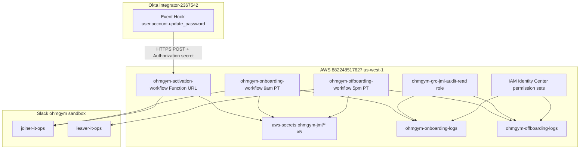
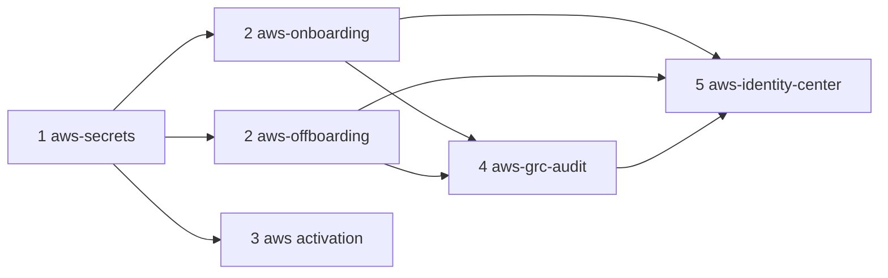

# AWS Account Migration — OhmGym Lab Isolation

Re-deploy all IT Operations Sandbox JML AWS infrastructure from account `430118826061` into the isolated OhmGym account `882248517627`, validate end-to-end, then destroy legacy stacks after soak.

Companion to:
- [08-okta-event-hook-lambda.md](08-okta-event-hook-lambda.md) — activation Lambda + Okta Event Hook
- [10-aws-scheduled-onboarding-workflow.md](10-aws-scheduled-onboarding-workflow.md) — proactive joiner
- [11-aws-scheduled-offboarding-workflow.md](11-aws-scheduled-offboarding-workflow.md) — proactive leaver
- [12-grc-jml-audit-access.md](12-grc-jml-audit-access.md) — GRC read role + Identity Center

## Post-migration outputs (882248517627)

Captured after `terraform apply` on 2026-07-03:

| Output | Value |
|---|---|
| Activation Function URL | `https://emf74co2vrvydfuzxkeqn5srt40ijtli.lambda-url.us-west-1.on.aws/` |
| GRC role ARN | `arn:aws:iam::882248517627:role/ohmgym-grc-jml-audit-read` |
| IC portal | https://d-91670e0759.awsapps.com/start |

**Okta Event Hook (manual):** paste the Function URL above into Okta Admin → Workflow → Event Hooks → Verify → Save.

Old account state backups for destroy: `terraform/.state-backup-430118826061/`.

---

> "I isolated the OhmGym lab from my other AWS projects by standing up a dedicated account with its own org and Identity Center, then re-deployed the full JML automation stack as code — not a resource move — so each environment has clean Terraform state, least-privilege boundaries, and a safe destroy path for the legacy account."

---

## Account identities

| | Old (source) | New (target) |
|---|---|---|
| Account ID | `430118826061` | **`882248517627`** |
| CLI profile | `default` / management | **`AWS_PROFILE=ohm-gym`** |
| IAM operator | `website-admin` (historical) | **`arn:aws:iam::882248517627:user/OhmGym`** |
| Organization | `o-37piwzwyzn` | `o-4gxzql0lf2` |
| Identity Center | `ssoins-8201b8267b073f96` / `d-916773644c` | **`ssoins-8201e2932463b8a0` / `d-91670e0759`** |
| IC portal | https://d-916773644c.awsapps.com/start | **https://d-91670e0759.awsapps.com/start** |
| Region | `us-west-1` | `us-west-1` |

Verify target account:

```bash
AWS_PROFILE=ohm-gym aws sts get-caller-identity
AWS_PROFILE=ohm-gym aws sso-admin list-instances --region us-west-1
```

---

## Architecture (target state)



---

## Identity Center decision

**Primary path: use new account IC only.**

- Apply `terraform/aws-identity-center/` with `AWS_PROFILE=ohm-gym` and `target_account_id = "882248517627"`.
- Portal: **https://d-91670e0759.awsapps.com/start**

**Rejected:** keep IC on old management account with cross-account assignments (couples accounts; defeats isolation).

**Deferred:** Okta SAML → AWS ([02-aws-saml-federation.md](02-aws-saml-federation.md)). Path C hybrid (`ohmgym-grc-jml-audit-read` assume-role) remains the Claude Desktop / CLI path until SAML.

| Approach | Pros | Cons |
|---|---|---|
| **New IC (chosen)** | Full isolation; IC already live; permission sets colocated with JML | New portal URL; users re-provisioned in Identity Store |
| Old IC cross-account | Single portal | Org coupling; old account dependency |
| Dual IC during cutover | Rollback window | Two portals; document authoritative portal until old destroyed |

---

## Prerequisites

### Operator workstation

- `AWS_PROFILE=ohm-gym` in `~/.aws/credentials` (**never commit** access keys).
- Old account credentials for secret export and post-validation destroy.
- Terraform `>= 1.6` (CI uses `1.9.8`).
- Python 3.12; run `bash lambdas/*/build.sh` before consumer stack applies.
- Project `.env` with Okta Private Key JWT creds (unchanged tenant).

### OhmGym IAM

`OhmGym` has `AdministratorAccess` — sufficient for all six stacks.

### State separation

Each stack uses **local state** (gitignored). Re-deploy creates fresh state in `882248517627` — no state migration from the old account.

---

## Secret copy procedure

Secrets are **re-created** via `terraform/aws-secrets/` — not cross-account moved.

### Path A — from project `.env` (recommended)

| Secret name | Source |
|---|---|
| `ohmgym-jml/slack-bot-token` | `SLACK_BOT_TOKEN` |
| `ohmgym-jml/okta-api-client-id` | `OKTA_CLIENT_ID` |
| `ohmgym-jml/okta-api-key-id` | `OKTA_KEY_ID` |
| `ohmgym-jml/okta-api-private-key` | `OKTA_PRIVATE_KEY` (PEM) |
| `ohmgym-jml/okta-webhook-secret` | existing hex (keep to avoid Okta re-verify) or generate new |

```bash
cp terraform/aws-secrets/terraform.tfvars.example terraform/aws-secrets/terraform.tfvars
chmod 600 terraform/aws-secrets/terraform.tfvars
# Fill from .env — DO NOT COMMIT
```

### Path B — export from old account

```bash
OLD_PROFILE=default
REGION=us-west-1

for NAME in slack-bot-token okta-api-client-id okta-api-key-id okta-api-private-key okta-webhook-secret; do
  aws secretsmanager get-secret-value --profile "$OLD_PROFILE" --region "$REGION" \
    --secret-id "ohmgym-jml/$NAME" --query SecretString --output text
done
```

**Webhook secret:** keep same value → only Okta hook URL changes at cutover. Rotate → re-apply `aws-secrets` and update Okta Authorization header.

---

## Per-stack deployment

```bash
export AWS_PROFILE=ohm-gym
export AWS_REGION=us-west-1
```

### Apply order



### Stack 1: `terraform/aws-secrets/`

```bash
cd terraform/aws-secrets
terraform init
terraform plan -out=secrets.tfplan
terraform apply secrets.tfplan
terraform output   # capture 5 ARNs for downstream stacks
```

### Stacks 2a/2b: `terraform/aws-onboarding/` + `terraform/aws-offboarding/`

```bash
bash lambdas/onboarding_workflow/build.sh
bash lambdas/offboarding_workflow/build.sh
```

`terraform.tfvars` — paste secret ARNs from stack 1 output (`882248517627`):

```hcl
slack_bot_token_secret_arn      = "arn:aws:secretsmanager:us-west-1:882248517627:secret:ohmgym-jml/slack-bot-token-XXXXXX"
okta_api_client_id_secret_arn   = "arn:aws:secretsmanager:us-west-1:882248517627:secret:ohmgym-jml/okta-api-client-id-XXXXXX"
okta_api_key_id_secret_arn      = "arn:aws:secretsmanager:us-west-1:882248517627:secret:ohmgym-jml/okta-api-key-id-XXXXXX"
okta_api_private_key_secret_arn = "arn:aws:secretsmanager:us-west-1:882248517627:secret:ohmgym-jml/okta-api-private-key-XXXXXX"
okta_org_url = "https://integrator-2367542.okta.com"
alarm_email  = "<operator-email>"
```

```bash
cd terraform/aws-onboarding   # repeat for aws-offboarding
terraform init && terraform plan -out=plan.tfplan && terraform apply plan.tfplan
```

### Stack 3: `terraform/aws/` (activation Lambda)

```bash
bash lambdas/okta_activation_handler/build.sh
cd terraform/aws
terraform init && terraform plan -out=plan.tfplan && terraform apply plan.tfplan
terraform output function_url   # SAVE for Okta cutover
```

### Stack 4: `terraform/aws-grc-audit/`

Requires DynamoDB tables from stacks 2a/2b.

```hcl
aws_region = "us-west-1"
trusted_principal_arns = [
  "arn:aws:iam::882248517627:user/OhmGym",
]
```

```bash
cd terraform/aws-grc-audit
terraform init && terraform plan -out=plan.tfplan && terraform apply plan.tfplan
terraform output grc_audit_role_arn
```

### Stack 5: `terraform/aws-identity-center/`

```hcl
aws_region = "us-west-1"
target_account_id = "882248517627"
grc_user_emails = ["weinreichchris@gmail.com"]
developer_user_emails = []
```

```bash
cd terraform/aws-identity-center
terraform init && terraform plan -out=plan.tfplan && terraform apply plan.tfplan
terraform output portal_url
```

---

## Integration re-pointing

### 1. Okta Event Hook (manual — required)

**Troubleshooting 403 on Verify:** Newer AWS accounts block public Function URLs unless the Lambda resource policy grants both `lambda:InvokeFunctionUrl` and `lambda:InvokeFunction` to `*`. The `terraform/aws/` stack declares both in `lambda.tf`. If you applied before this fix, run `terraform apply` in `terraform/aws/` and retry Verify.

1. Okta Admin → **Workflow → Event Hooks**
2. Update **URL** to new `terraform output function_url` from `terraform/aws/`
3. **Authorization header:** keep existing secret (if unchanged)
4. **Verify** → expect 200
5. Save

### 2. Slack

Same `xoxb-` bot token in new Secrets Manager → no Slack changes unless token rotates.

### 3. GRC MCP / CLI

`~/.aws/config`:

```ini
[profile ohmgym-grc-jml-audit]
region = us-west-1
role_arn = arn:aws:iam::882248517627:role/ohmgym-grc-jml-audit-read
source_profile = ohm-gym
```

See [claude-desktop-grc-aws-mcp.md](claude-desktop-grc-aws-mcp.md). Restart Claude Desktop after edits.

### 4. Integration tests

```bash
AWS_PROFILE=ohm-gym JML_INTEGRATION=1 pytest tests/integration/test_jml_aws_live.py -v
```

---

## Validation checklist

| # | Check | Pass criteria |
|---|---|---|
| 1 | Secrets exist | 5 `ohmgym-jml/*` secrets in `us-west-1`, account `882248517627` |
| 2 | Lambdas deployed | 3 functions Active in `us-west-1` |
| 3 | DynamoDB tables | `ohmgym-onboarding-logs`, `ohmgym-offboarding-logs` ACTIVE |
| 4 | GRC role | `ohmgym-grc-jml-audit-read` trusts `OhmGym` |
| 5 | GRC read | `AWS_PROFILE=ohmgym-grc-jml-audit python scripts/grc/query_jml_audit.py --table offboarding --scan --max-items 2` |
| 6 | GRC write denied | `put-item` as GRC role → `AccessDeniedException` |
| 7 | Onboarding smoke | `seed_staged_user.py` + `invoke_onboarding_workflow.py --tail-logs` |
| 8 | Activation hook | Okta Verify + test activation → CloudWatch + Slack |
| 9 | Offboarding smoke | `invoke_offboarding_workflow.py` |
| 10 | Schedulers | 9 AM / 5 PM PT cron ENABLED |
| 11 | IC portal | Sign in https://d-91670e0759.awsapps.com/start |
| 12 | Integration suite | `AWS_PROFILE=ohm-gym JML_INTEGRATION=1 pytest tests/integration -v` |

---

## Cutover procedure

1. Deploy all 6 stacks in new account (Okta hook can still point at old URL briefly).
2. Smoke-test new stack manually before switching Okta.
3. **Disable old schedulers** (prevents duplicate JML runs):

```bash
OLD_PROFILE=default
aws scheduler update-schedule --profile "$OLD_PROFILE" --region us-west-1 \
  --name ohmgym-onboarding-workflow --state DISABLED --flexible-time-window Mode=OFF \
  --schedule-expression 'cron(0 9 * * ? *)' --schedule-expression-timezone 'America/Los_Angeles' \
  --target Arn=<old-lambda-arn>,RoleArn=<old-scheduler-role-arn>
# Repeat for ohmgym-offboarding-workflow (5 PM cron)
```

4. Update Okta Event Hook URL to new `function_url`; Verify + save.
5. Confirm new schedulers ENABLED on `ohm-gym` profile.
6. Run validation checklist (all 12 items).
7. After 24–48h soak → destroy old stacks (see below).

---

## Rollback

1. Revert Okta Event Hook URL to old `function_url`.
2. Re-enable old schedulers; disable new ones.
3. Revert GRC `role_arn` to `arn:aws:iam::430118826061:role/ohmgym-grc-jml-audit-read`.
4. Do not destroy new stacks until root cause is fixed.

---

## Destroy order (old account `430118826061`)

**Completed 2026-07-03** after validation. Old schedulers disabled; stacks destroyed via restored state in `terraform/.state-backup-430118826061/`. GRC IAM role removed via CLI (no state backup existed).

**Only after validation soak. Do NOT destroy the org management account without explicit decision.**

| Order | Stack |
|---|---|
| 1 | `terraform/aws-identity-center/` |
| 2 | `terraform/aws-grc-audit/` |
| 3 | `terraform/aws/` |
| 4 | `terraform/aws-offboarding/` |
| 5 | `terraform/aws-onboarding/` |
| 6 | `terraform/aws-secrets/` |

```bash
OLD_PROFILE=default
export AWS_PROFILE=$OLD_PROFILE

cd terraform/<stack>
terraform plan -destroy -out=destroy.tfplan
terraform apply destroy.tfplan
```

**Out of scope:** deleting Organization `o-37piwzwyzn` or closing account `430118826061`.

---

## Risks and mitigations

| Risk | Mitigation |
|---|---|
| Duplicate schedulers | Disable old schedulers before cutover |
| Dual Terraform state | Expected; destroy old after validation |
| Secret drift | Copy from `.env`; run integration tests |
| Webhook secret rotation | Keep same secret unless intentionally rotating |
| GRC wrong region/table | Use `us-west-1` and `ohmgym-*-logs` exact names |
| Lambda zip stale | `build.sh` before each consumer stack plan |
| Destroying management account | Destroy stacks only; org closure is separate decision |

---

## Links

- [`config/aws/desired-state.json`](../config/aws/desired-state.json) — AWS metadata after migration
- [`terraform/aws-secrets/`](../terraform/aws-secrets/) — shared secrets root
- [`.env.example`](../.env.example) — local credential template (no secrets committed)
