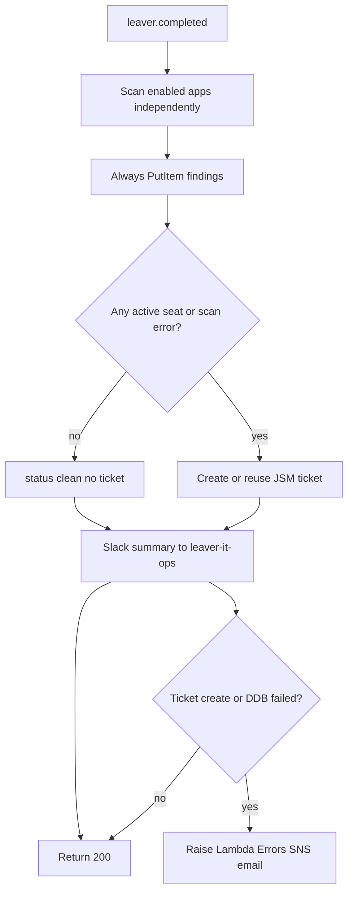
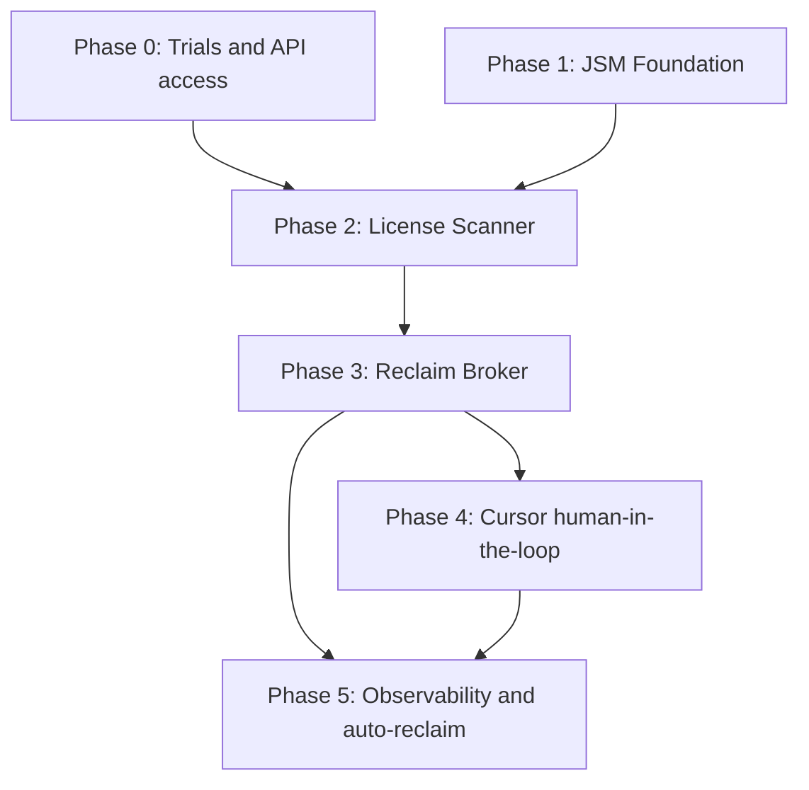

# License Reclamation — Human-in-the-Loop Product Roadmap

Product roadmap for reclaiming SaaS seats after offboarding when apps are **not SCIM-provisioned**. A deterministic **License Scanner Lambda** inventories GitHub, Linear, and Jira after Okta deactivation; findings land in **Jira Service Management (JSM)**. An IT-Ops agent uses **Cursor / Claude Code** (read ticket → call reclaim broker) so writes stay allowlisted and auditable. Email is failure-only; Slack remains same-day visibility.

**Architecture variant:** Deterministic scan + ticket + human-gated reclaim. Optional LLM orchestration for decision support; **broker Lambda is the only write path** to SaaS admin APIs. The agent never holds raw revoke credentials.

**Status (14 Aug 2026):** Phase 0 and Phase 1 are complete. Next build is Phase 2 (scanner Lambda). Figma is parked; Linear replaced it as the third v1 connector. See:

- [License Reclaimer/phase-0-trials-and-credentials.md](License%20Reclaimer/phase-0-trials-and-credentials.md)
- [License Reclaimer/phase-1-jsm-foundation.md](License%20Reclaimer/phase-1-jsm-foundation.md)

Companion to:

- [11-aws-scheduled-offboarding-workflow.md](11-aws-scheduled-offboarding-workflow.md) — EventBridge → Okta deactivate (trigger upstream)
- [07-end-to-end-leaver-demo.md](07-end-to-end-leaver-demo.md) — manual leaver CLI
- [13-access-review-broker-agent-prd.md](13-access-review-broker-agent-prd.md) — same agent-read / broker-write pattern (mirror for *grants*)
- [12-grc-jml-audit-access.md](12-grc-jml-audit-access.md) — GRC read of audit tables
- Dashboard collectors in `dashboard/` — license seat inventory UI (extend for reclaim findings)

---

## Problem statement

Okta deactivation + SCIM covers Slack and GWS for federated users. NovaTech also runs **non-SCIM** SaaS (GitHub org membership, Linear workspace seats, Jira Cloud accounts) where orphaned memberships keep consuming paid seats after a leaver’s last day.

Today that gap is console clicks and tribal memory. NovaTech needs:

1. **Automatic discovery** of active seats right after offboarding
2. **A durable work queue** for IT-Ops (JSM), not email threads — including when a scan is incomplete, so “unknown” never looks like “clean”
3. **Human judgment** before destructive revoke (shared seats, legal hold, contractor exceptions)
4. **API-driven reclaim** with least privilege and a three-way audit trail
5. **Optional AI copilot** so agents reclaim from a ticket prompt without holding god-mode admin keys

This mirrors Corporate Engineering / Business Technology expectations: API automation across SaaS, ITSM handoff, IaC, least-privilege security workflows, and AI as decision support — not autonomous write authority.

---

## Goals

| Goal                                    | Success metric                                                                                        |
| --------------------------------------- | ----------------------------------------------------------------------------------------------------- |
| Scan after every successful offboarding | 100% of deactivated leavers get a scan attempt within the same run window                             |
| Ticket when work remains                | JSM **License Reclamation** issue opened when ≥1 app is `active` **or** `error`                       |
| Human gate before revoke                | Zero SaaS revoke without ticket acknowledgment (status or explicit agent prompt)                      |
| Broker-only writes                      | Cursor/Claude never calls GitHub/Linear/Jira admin APIs with write tokens directly                    |
| Audit correlation                       | `correlation_id = JIRA-{issue_key}` (or `OFFBOARD-{run_id}` if clean) in DynamoDB + CloudWatch + Jira |
| Expand app catalog                      | Adding a fourth app = connector + allowlist entry, not a rewrite                                      |

---

## Non-goals (v1)

- Fully autonomous revoke with no human in the loop
- SCIM enablement for GitHub / Linear / Jira (out of band; this roadmap covers API reclaim)
- Figma member inventory on Starter (no public team-members REST route; parked — see Phase 0)
- Jira **licensed product seats** (Admin Hub / `manage:jira-configuration`); v1 scan is account-exists via user search
- JSM portal / request-type configuration via MCP or Terraform (UI-first in JSM Admin)
- LLM direct SaaS admin writes
- Replacing Okta offboarding Lambda (scanner is downstream of doc 11)
- Tines / Okta Workflows orchestration (Lambda preferred for this sandbox)
- Billing reconciliation against vendor invoices

---

## Personas

| Persona                               | Role                    | Interaction                                       |
| ------------------------------------- | ----------------------- | ------------------------------------------------- |
| **Leaver**                            | Departing employee      | No interaction; subject of scan                   |
| **IT-Ops agent (human)**              | Service desk            | Owns JSM queue; prompts Cursor/Claude to reclaim  |
| **License Scanner (machine)**         | Deterministic inventory | Lambda: read SaaS APIs → JSM + Slack + DynamoDB   |
| **Reclaim broker (machine)**          | Write executor          | Lambda: allowlisted revoke only                   |
| **AI copilot (Cursor / Claude Code)** | Orchestration assist    | Reads JSM via MCP; calls broker; comments results |
| **GRC analyst**                       | Audit consumer          | DynamoDB / dashboard read of reclaim outcomes     |

---

## Target architecture

```
┌─────────────────────────────────────────────────────────────────────────────┐
│  EventBridge 5pm PT                                                          │
│       │                                                                      │
│       ▼                                                                      │
│  Offboarding Lambda (doc 11)                                                 │
│       │  Okta session revoke + deactivate                                    │
│       │  DynamoDB ohmgym-offboarding-logs                                    │
│       │  Slack #leaver-it-ops                                                │
│       ▼                                                                      │
│  emit leaver.completed  (user email, okta_id, run_id, run_date)              │
│       │                                                                      │
│       ▼                                                                      │
│  License Scanner Lambda  (deterministic, read-only secrets)                  │
│       │  GitHub: org membership?                                             │
│       │  Linear: workspace member (human email)?                             │
│       │  Jira: account exists (gateway user search)?                         │
│       │  Figma: skipped (enabled: false)                                     │
│       │                                                                      │
│       ├─ all enabled apps not_member, no errors                              │
│       │     → DynamoDB status=clean + Slack footnote                         │
│       ├─ any active and/or any scan error                                    │
│       │     → create or reuse JSM "License Reclamation" ticket               │
│       │       + Slack #leaver-it-ops summary                                 │
│       │       + DynamoDB findings (ticketed | partial | error)               │
│       └─ infra / JSM create failure after persist                            │
│             → raise Lambda Errors → SNS email (doc 11 pattern)               │
│                                                                              │
│  ─── human-in-the-loop ───                                                   │
│                                                                              │
│  IT-Ops opens JSM ticket                                                     │
│       │                                                                      │
│       ▼                                                                      │
│  Prompt Cursor / Claude Code                                                 │
│       │  Jira MCP: read SUP-nnn (user, apps[], correlation_id)               │
│       │  Confirm plan (skip / hold / reclaim)                                │
│       │  POST /v1/licenses/reclaim  → Reclaim Broker Lambda                  │
│       │  Jira MCP: comment results + transition Done                         │
│       ▼                                                                      │
│  Reclaim Broker                                                              │
│       │  Allowlist: config/licenses/apps.json                                │
│       │  Validate ticket key + user match scan findings                      │
│       │  Scoped write secrets (separate from scanner read keys)              │
│       ▼                                                                      │
│  GitHub / Linear / Jira admin APIs                                           │
│       ▼                                                                      │
│  Observability: Jira comment + DynamoDB + CloudWatch JSON                    │
└─────────────────────────────────────────────────────────────────────────────┘
```

### Deterministic vs agentic (roadmap stance)

| Layer          | v1 choice                                             | Why                                                                 |
| -------------- | ----------------------------------------------------- | ------------------------------------------------------------------- |
| Discovery      | **Deterministic** scanner Lambda                      | Fixed app list; reliable; cheap; matches JD “API-driven automation” |
| Work queue     | **JSM ticket**                                        | Durable ITSM handoff; not email                                     |
| Decision       | **Human** (+ optional LLM assist)                     | Shared seats, holds, exceptions                                     |
| Actuation      | **Deterministic broker**                              | Allowlist + least privilege; agent never holds write keys           |
| Future agentic | Optional orchestrator that emits a `ReclaimPlan` JSON | Only after broker exists; still no LLM-held write tokens            |

---

## Architectural decisions (ADRs)

| ID      | Decision                                                                        | Rationale                                                                                 |
| ------- | ------------------------------------------------------------------------------- | ----------------------------------------------------------------------------------------- |
| ADR-001 | Scanner is a separate Lambda from offboarding                                   | Failure of reclaim inventory must not block Okta deactivate; separate IAM + secrets       |
| ADR-002 | Trigger via EventBridge custom event / async invoke after successful deactivate | Loose coupling; replayable per user. **2 retries + SQS DLQ** (see Error handling)         |
| ADR-003 | JSM ticket is source of truth for manual reclaim work                           | Matches Freshservice/JSM mental model on Corporate Engineering JDs; email is failure-only |
| ADR-004 | Keep Slack `#leaver-it-ops` for visibility                                      | Same ops channel as doc 11; not the work queue                                            |
| ADR-005 | Broker is the only SaaS write path                                              | Same security posture as access-review broker (doc 13)                                    |
| ADR-006 | Read secrets ≠ write secrets                                                    | Scanner starts read-only; expand write via separate Secrets Manager ARNs                  |
| ADR-007 | JSM Admin configured in UI                                                      | Atlassian MCP cannot configure request types / portal (see MCP boundaries)                |
| ADR-008 | v1 catalog is GitHub, Linear, Jira; Figma parked                                | Phase 0: Figma Starter has no team-members REST route; Linear GraphQL `users` does        |
| ADR-009 | Autoreclaim is opt-in per app later                                             | Human-in-the-loop first; auto-revoke only for apps marked `auto_reclaim: true`            |
| ADR-010 | Continue per app; raise only on infra or work-queue failure                     | Mirror offboarding handler: one SaaS blip must not hide other findings or skip JSM        |
| ADR-011 | Never classify auth / SKU / gateway 401 as `not_member`                         | Phase 0: Jira site-URL 401 and Figma members 404 are misconfig/SKU, not absence           |

---

## Data model

### Scanner findings (DynamoDB `ohmgym-license-reclaim-logs`)

| Attribute           | Notes                                                                                          |
| ------------------- | ---------------------------------------------------------------------------------------------- |
| `pk`                | `run_date` (PT)                                                                                |
| `sk`                | `user_id` (Okta id)                                                                            |
| `login` / `okta_id` | Identity snapshot                                                                              |
| `apps`              | List of per-app results (shape below)                                                          |
| `jira_issue_key`    | Set when ticket created or reused                                                              |
| `status`            | Row-level outcome (shape below)                                                                |
| `correlation_id`    | `JIRA-{issue_key}` or `OFFBOARD-{run_id}` if clean                                             |
| `error_class`       | Set on row when `status=error` (infra / `work_queue` / `all_connectors_failed`)                |
| `ttl_epoch`         | 90 days                                                                                        |

**Per-app `apps[]` object:**

```json
{
  "app": "github",
  "status": "active",
  "seat_type": "org_member",
  "action_hint": "remove_org_member",
  "error_class": null,
  "http_status": 204,
  "retryable": false,
  "error": null
}
```

| `apps[].status` | Meaning |
| --------------- | ------- |
| `active`        | Confirmed paid/membership seat |
| `not_member`    | Confirmed absence (success path for that app) |
| `skipped`       | App `enabled: false` in allowlist (Figma) |
| `error`         | Scan did not produce a reliable membership answer |

Optional on `error`: `error_class`, `http_status`, `retryable`, `error` (truncated vendor message, no tokens).

**Row-level `status`:**

| Value       | When                                                                 | Ticket? |
| ----------- | -------------------------------------------------------------------- | ------- |
| `clean`     | Every enabled app is `not_member`; no errors                         | No      |
| `ticketed`  | ≥1 `active`, zero `error`                                            | Yes     |
| `partial`   | Mix of `active` and `error` (other apps may be `not_member`)         | Yes     |
| `error`     | Work-queue handoff failed, or every enabled app is `error`           | Yes if JSM create succeeded; else Slack + raise |
| `reclaimed` | Phase 3 broker completed all requested revokes                       | Existing ticket |

---

### JSM request type: **License Reclamation**

Configured in JSM Admin (not MCP). **Shipped in Phase 1** on site `buffett-dev.atlassian.net`, project **Support (`SUP`)**, request type id `4`. Sample: [SUP-2](https://buffett-dev.atlassian.net/browse/SUP-2). Field IDs: [`config/jira/field-mapping.json`](../config/jira/field-mapping.json).

All five reclaim fields are **Short text** (not Paragraph). Scanner writes a comma-separated app list, not a rich-text table.

| Field                  | Jira id             | Purpose                                      |
| ---------------------- | ------------------- | -------------------------------------------- |
| Leaver email           | `customfield_10138` | Primary subject                              |
| Okta user ID           | `customfield_10139` | Stable ID for broker                         |
| Offboarding run ID     | `customfield_10140` | Link to doc 11 audit                         |
| Apps requiring action  | `customfield_10141` | Confirmed `active` keys only, e.g. `github, linear` |
| Hold / exception notes | `customfield_10142` | Human judgment **and** scanner error summary |

Request type cannot be set by name via REST. Create the issue, then set `customfield_10010` to `"4"`.

---

### App allowlist (`config/licenses/apps.json`)

Matches the committed stub (Figma parked after Phase 0):

```json
{
  "github": {
    "label": "GitHub",
    "enabled": true,
    "auto_reclaim": false,
    "read_secret": "ohmgym-licenses/github-read",
    "write_secret": "ohmgym-licenses/github-write",
    "actions": ["remove_org_member"]
  },
  "linear": {
    "label": "Linear",
    "enabled": true,
    "auto_reclaim": false,
    "read_secret": "ohmgym-licenses/linear-read",
    "write_secret": "ohmgym-licenses/linear-write",
    "actions": ["suspend_user"]
  },
  "jira": {
    "label": "Jira / Atlassian",
    "enabled": true,
    "auto_reclaim": false,
    "read_secret": "ohmgym-licenses/jira-read",
    "write_secret": "ohmgym-licenses/jira-write",
    "actions": ["remove_product_access", "deactivate_user"]
  },
  "figma": {
    "label": "Figma",
    "enabled": false,
    "auto_reclaim": false,
    "read_secret": "ohmgym-licenses/figma-read",
    "write_secret": "ohmgym-licenses/figma-write",
    "actions": ["remove_team_member"],
    "parked_reason": "Starter plan has no team-members REST endpoint; Organization/Enterprise required. Phase 0 probe 2026-08-13."
  }
}
```

---

### Broker API (planned)

`POST /v1/licenses/reclaim`

```json
{
  "issue_key": "SUP-42",
  "user_email": "marcus.reyes@ohmgym.com",
  "okta_user_id": "00u…",
  "apps": ["github", "linear"],
  "dry_run": false,
  "requested_by": "chris@ohmgym.com"
}
```

Broker validates: apps ⊆ allowlist, findings exist for user, ticket not already fully reclaimed, secrets present. Rejects unknown apps with HTTP 400. Same `error_class` vocabulary as the scanner. **Never revoke** an app whose scan status is `error` or `identity_unresolved`.

---

## Error handling (Phase 2 contract)

Scanner failure policy mirrors [`lambdas/offboarding_workflow/handler.py`](../lambdas/offboarding_workflow/handler.py): **continue per app, raise only on infrastructure or work-queue failure** (ADR-010). Okta deactivate must stay isolated (ADR-001). “Unknown” must never look like “clean” (ticket rule below).



### Failure taxonomy

| Class | Examples | Handler behavior | Lambda Errors / SNS |
| --- | --- | --- | --- |
| **Infra** | Secrets Manager miss, DynamoDB PutItem fail, invalid `leaver.completed` payload | Abort the run after best-effort persist | **Yes** (raise) |
| **Connector unknown** | 429/5xx after in-Lambda retries, timeout, Linear GraphQL transport error | Record `apps[].error`; keep scanning other apps | No |
| **Misconfig** | Jira called at site URL (Phase 0 401), missing `JIRA_CLOUD_ID`, Linear key from wrong workspace | Same as connector unknown; `error_class=misconfig` | No (unless **all** enabled apps fail — then also raise) |
| **Not a member** | GitHub 404, Linear human email absent, Jira user search empty | `status=not_member` — success path | No |
| **Identity unresolved** | No GitHub username for Okta email | `error_class=identity_unresolved`; do not call GitHub | No (ticket still opens) |
| **Work-queue fail** | Seats or scan errors exist but JSM issue create fails | DDB `status=error`; Slack error line | **Yes** (raise after persist) |
| **Visibility fail** | Slack `chat.postMessage` fails | Log; do not fail the scan | No (email is failure-only, same as [doc 11](11-aws-scheduled-offboarding-workflow.md)) |

**Ticket rule:** open (or reuse) a License Reclamation ticket when **any enabled app is `active` OR any enabled app is `error`**. Confirmed seats go in `customfield_10141` (comma-separated keys). Scan errors go in the issue description and `customfield_10142`. Disabled apps (`figma`) are omitted from both.

**All connectors failed, no confirmed seats:** still ticket (scan incomplete) + Slack + raise, so ITSM is the work queue and SNS still fires.

### Per-app HTTP classification (Phase 0 evidence)

Connectors must not collapse auth, SKU, or gateway failures into `not_member` (ADR-011).

| App | Probe | `active` | `not_member` | `misconfig` / SKU | Retryable |
| --- | --- | --- | --- | --- | --- |
| **GitHub** | `GET /orgs/ohmgym-sandbox/members/{login}` | 204 | **404** | 401/403 | 429/5xx |
| **Jira** | `GET https://api.atlassian.com/ex/jira/{cloudId}/rest/api/3/user/search?query={email}` | ≥1 matching account | Empty array | Site URL `*.atlassian.net` **401**; missing `JIRA_CLOUD_ID` | 429/5xx |
| **Linear** | GraphQL `users { nodes { email active } }` on workspace `it-systems-sandbox` | Human email present and `active` | Human email absent | Viewer org uuid ≠ `2cb9e2d3-f42b-42a1-a066-8bc4006c2624`; ignore `*.linear.app` identities | HTTP 429/5xx or GraphQL transport failure |
| **Figma** | skipped (`enabled: false`) | — | — | If re-enabled: `GET /v1/teams/{id}/members` **404 is SKU**, not absence | — |

Jira v1 scan is **account-exists**, not licensed product seats. `GET /applicationrole` returned 401 in Phase 0 (`scope does not match`). That gap is a documented non-goal, not a scanner `error`.

### Identity resolution

GitHub membership is **login-based**; `leaver.completed` carries **email**. Missing username mapping is `identity_unresolved` (ticket + notes), not a silent skip and not a GitHub 404. Mapping source is still an [open question](#open-questions) (env map vs Okta profile vs ticket field). Linear and Jira match on email directly.

### Retries, DLQ, idempotency, alarms

| Layer | Policy |
| --- | --- |
| **In-Lambda HTTP** | 2–3 attempts with short backoff on **429/5xx only**. Timeouts 10–15s (match offboarding). **Do not retry** 401/403/404. |
| **EventBridge target** | `maximum_retry_attempts = 2` on the scanner rule. Prefer in-Lambda connector retries so a GitHub blip does not re-scan Linear/Jira from scratch. Offboarding’s scheduler uses `0` because it is a daily poll with a replay CLI; this is a **downstream event**. |
| **DLQ** | SQS dead-letter on the EventBridge rule for exhausted invokes (`ohmgym-license-scanner-dlq`, created in Phase 2 Terraform). |
| **Idempotency** | `GetItem(run_date, user_id)`. If `jira_issue_key` is already set, **comment/update** that issue — never create a second ticket. Secondary guard: `project = SUP AND "Request Type" = "License Reclamation" AND "Leaver email" ~ "{email}" AND "Offboarding run ID" = "{run_id}"`. |
| **Alarms** | Copy [`terraform/aws-offboarding/alarms.tf`](../terraform/aws-offboarding/alarms.tf): `AWS/Lambda` Errors ≥ 1 in 5 minutes → SNS email. `treat_missing_data = notBreaching`. Slack on **every** run, including errors. |

### Slack vs SNS

| Signal | Path | Success / clean | Connector error (partial) | Infra or JSM create fail |
| --- | --- | --- | --- | --- |
| Structured logs | CloudWatch `/aws/lambda/ohmgym-license-scanner` | `license_scan_complete` | same + per-app `error_class` | `license_scan_failed` + stack |
| Audit | DynamoDB `ohmgym-license-reclaim-logs` | `status=clean` | `ticketed` or `partial` | `status=error` |
| Operator visibility | Slack `#leaver-it-ops` | Footnote or summary | Summary lists apps + errors | Error line |
| Email | SNS via CW alarm | **Nothing** | **Nothing** | Email |

### CloudWatch JSON fields

Every scanner log line includes:

| Field | Notes |
| --- | --- |
| `event` | `license_scan_complete` \| `license_scan_failed` \| `connector_error` \| `jira_create_failed` |
| `correlation_id` | `JIRA-{key}` or `OFFBOARD-{run_id}` |
| `run_date` / `run_id` / `okta_id` / `login` | Identity + batch |
| `error_class` | `infra` \| `misconfig` \| `retryable` \| `identity_unresolved` \| `work_queue` \| `all_connectors_failed` |
| `http_status` | Vendor HTTP when applicable |
| `retryable` | Boolean |
| `apps` | Same array persisted to DynamoDB |

Never log tokens, Authorization headers, or secret ARNs’ values.

### Phase 3 / 4 reuse

Do not invent a second matrix. Broker (Phase 3) records partial success per app with the same `error_class` values and **refuses revoke** when scan status is `error` or `identity_unresolved` (extend P3-R5). The Phase 4 skill’s failure handling (P4-R6) points here: comment broker/scanner errors on the ticket; do not transition Done while any requested app is `error`.

---

## MCP / tool boundaries

| Tool                | Read                                | Write                 | Phase |
| ------------------- | ----------------------------------- | --------------------- | ----- |
| **Atlassian MCP**   | JSM ticket fields, JQL              | Comments, transitions | 1, 4  |
| **Okta MCP / API**  | User profile (optional cross-check) | None for reclaim      | 2+    |
| **License Scanner** | SaaS membership APIs                | Create JSM issue only | 2     |
| **Reclaim Broker**  | Ticket + findings validation        | SaaS revoke APIs      | 3–4   |
| **Cursor / Claude** | Ticket + plan                       | Calls broker only     | 4     |

**JSM Admin (project, request type, portal, queues):** not available via MCP — done in UI in Phase 1.

---

## Phase roadmap

### Phase 0 — Trials & credentials

**Status:** Complete (13 Aug 2026) for the v1 catalog (GitHub + Jira + Linear). Figma parked. P0-R5 demo-user seeding still open. Log: [phase-0-trials-and-credentials.md](License%20Reclaimer/phase-0-trials-and-credentials.md).

**Objective:** Stand up GitHub, Linear, and Jira sandbox tenants with API access and SSO notes. No automation yet.

| ID    | Requirement                                                                              | Outcome |
| ----- | ---------------------------------------------------------------------------------------- | ------- |
| P0-R1 | GitHub org; PAT with **read:org** / membership scope for scan                            | Met. Org `ohmgym-sandbox`. |
| P0-R2 | Third connector with a membership list API on a free/trial SKU                           | Met via **Linear** (`it-systems-sandbox`). Figma Starter parked (members 404). |
| P0-R3 | Existing Jira/JSM site; API token for issue create + user lookup                         | Met. `buffett-dev`; scoped token; **gateway URL required**. |
| P0-R4 | Document OIN / SSO notes per app (even if SAML gated on paid tier)                       | Met. All three: SSO/SCIM paid-tier. |
| P0-R5 | Seed 2–3 test users mirrored to Okta leavers for demos                                   | **Open.** Same emails on all three apps in one pass. |

**Exit criteria:** Manual curl/Python can answer “is user X a member?” for all three v1 apps. **Met** after substituting Linear for Figma.

---

### Phase 1 — JSM foundation

**Status:** Complete. Log: [phase-1-jsm-foundation.md](License%20Reclaimer/phase-1-jsm-foundation.md).

**Objective:** License Reclamation request type exists. Field IDs documented. MCP can read a test ticket.

| ID    | Requirement                                                                      | Outcome |
| ----- | -------------------------------------------------------------------------------- | ------- |
| P1-R1 | JSM project with **License Reclamation** request type                            | Met. Project `SUP`, request type id `4`. |
| P1-R2 | Agent fields: leaver email, Okta ID, run ID, apps list, notes                    | Met. All Short text. |
| P1-R3 | Queue for IT-Ops                                                                 | Met. Queue JQL filters request type + unresolved. |
| P1-R4 | `JIRA_*` credentials in `.env` / Secrets Manager                                 | Met in gitignored `.env`. Promote to Secrets Manager in Phase 2. |
| P1-R5 | `config/jira/field-mapping.json` includes reclaim fields                         | Met. |
| P1-R6 | One manually created sample ticket; Atlassian MCP reads custom fields            | Met. [SUP-2](https://buffett-dev.atlassian.net/browse/SUP-2). |

**Exit criteria:**

- [x] Request type visible to agents
- [x] Field IDs committed for automation
- [x] MCP `getJiraIssue` returns structured reclaim fields

**Deliverables:**

```
config/jira/field-mapping.json   # extended
config/licenses/apps.json        # stub allowlist (Linear in, Figma parked)
```

---

### Phase 2 — Deterministic License Scanner Lambda

**Status:** Next. Error-handling contract is specified above; implement it in the handler, not as an afterthought.

**Objective:** After offboarding success, scan GitHub / Linear / Jira (read-only). Ticket + Slack + DynamoDB when seats remain **or** a scan is incomplete.

| ID     | Requirement                                                                                                             |
| ------ | ----------------------------------------------------------------------------------------------------------------------- |
| P2-R1  | Terraform stack `terraform/aws-license-reclaim/` (or module under offboarding)                                          |
| P2-R2  | EventBridge rule on `leaver.completed`; `maximum_retry_attempts = 2`; SQS DLQ `ohmgym-license-scanner-dlq`              |
| P2-R3  | Connectors: `scripts/licenses/{github,linear,jira}_client.py` (Figma client not required while `enabled: false`)        |
| P2-R4  | Read-only secrets in Secrets Manager; IAM grants GetSecretValue on read ARNs only                                       |
| P2-R5  | If any `status=active` **or** any `status=error` → create or reuse JSM issue (`customfield_10010` = `"4"`)              |
| P2-R6  | Always write DynamoDB findings row; Slack summary to `#leaver-it-ops` (Slack failure does not raise)                    |
| P2-R7  | Idempotent: `GetItem` then JQL guard; same `(run_date, user_id)` comments the existing ticket, does not open a duplicate |
| P2-R8  | `--dry-run` / `dry_run` event flag prints plan without Jira create                                                      |
| P2-R9  | Unit tests with mocked HTTP for all three connectors **and** the failure cases in exit criteria                         |
| P2-R10 | Extend dashboard or workflows UI to show reclaim findings (optional same phase)                                         |
| P2-R11 | Persist `error_class`, `http_status`, `retryable` on each `apps[]` error; structured CloudWatch JSON                    |
| P2-R12 | Isolate connectors: one app’s exception does not skip the others (ADR-010)                                              |
| P2-R13 | Ticket on unknown: never map connector `error` to row `status=clean`                                                    |
| P2-R14 | Jira connector uses `https://api.atlassian.com/ex/jira/{cloudId}/...` only (ADR-011)                                    |
| P2-R15 | Missing GitHub username → `identity_unresolved`; do not call membership API; still ticket                               |
| P2-R16 | Raise (SNS path) on infra, JSM create failure after persist, or all enabled connectors failed                           |

**Exit criteria:**

- [ ] Deactivate test leaver → scanner runs → ticket lists exact apps with active seats
- [ ] Clean user (no seats, no errors) → `status=clean`, no ticket
- [ ] GitHub **404** → `not_member`; GitHub **401** → `misconfig` (not `not_member`)
- [ ] Jira called at site URL → `misconfig` 401; gateway empty search → `not_member`
- [ ] Linear timeout + GitHub `active` → one ticket, row `status=partial`, Linear `error_class=retryable`
- [ ] Duplicate invoke with existing `jira_issue_key` → no second ticket
- [ ] JSM create **500** after findings persist → DDB `status=error`, Slack error line, Lambda raises (alarm / SNS)
- [ ] Forced secret-load failure → Lambda Errors + SNS; offboarding Lambda unaffected

**Deliverables:**

```
lambdas/license_scanner/handler.py
scripts/licenses/
config/licenses/apps.json
terraform/aws-license-reclaim/
tests/unit/test_license_scanner.py
```

---

### Phase 3 — Reclaim Broker (deterministic writes)

**Objective:** Allowlisted revoke API. Dry-run default. No Cursor required yet — `curl` / CLI proves the path.

| ID    | Requirement                                                                                 |
| ----- | ------------------------------------------------------------------------------------------- |
| P3-R1 | `POST /v1/licenses/reclaim` on Lambda Function URL (mirror access broker)                   |
| P3-R2 | Separate write secrets; scanner role cannot read them                                       |
| P3-R3 | Reject apps not in findings for that user / not on allowlist                                |
| P3-R4 | Per-app actions: GitHub remove member; Linear suspend; Jira remove access / deactivate      |
| P3-R5 | Idempotent reclaim; partial success recorded per app with the **same `error_class` vocabulary** as the scanner. Never revoke `error` or `identity_unresolved` apps. |
| P3-R6 | Webhook / Function URL auth (shared secret or signed header)                                |
| P3-R7 | CLI: `scripts/licenses/reclaim.py --issue SUP-42 --dry-run`                                 |
| P3-R8 | On success, update DynamoDB + optional Jira comment from broker                             |

**Exit criteria:**

- [ ] Dry-run shows accurate plan
- [ ] Live reclaim removes GitHub membership for test user; ticket commentable via CLI
- [ ] Unknown app key → 400, no SaaS call
- [ ] Broker refuses revoke when scan finding for that app is `error` / `identity_unresolved`

**Deliverables:**

```
lambdas/license_reclaim_broker/handler.py
scripts/licenses/reclaim.py
terraform/aws-license-reclaim/ (broker + write IAM)
```

---

### Phase 4 — Human-in-the-loop Cursor / Claude skill

**Objective:** Service desk agent prompts Cursor/Claude from the ticket; copilot reads JSM, calls broker, comments and transitions.

| ID    | Requirement                                                                    |
| ----- | ------------------------------------------------------------------------------ |
| P4-R1 | Cursor skill / Claude skill: “Reclaim licenses for ticket {key}”               |
| P4-R2 | Skill uses Atlassian MCP to load ticket; never invents user/apps               |
| P4-R3 | Skill proposes plan; waits for human confirm in chat for destructive calls     |
| P4-R4 | Skill calls broker with `issue_key` + allowlisted apps only                    |
| P4-R5 | On broker response: comment per-app results; transition to Done when all clear |
| P4-R6 | Runbook: example prompts + failure handling **per [Error handling](#error-handling-phase-2-contract)** — comment errors; do not Done while any requested app is `error` |
| P4-R7 | Negative test: prompt to reclaim user **not** on ticket → broker/skill refuse  |

**Example agent prompt:**

> Pull SUP-42. For the leaver on the ticket, reclaim GitHub and Linear via the license broker. Skip Jira. Comment results and set Done if both succeed.

**Exit criteria:**

- [ ] End-to-end: offboard → scan ticket → Cursor reclaim → seats gone → ticket Done
- [ ] Broker logs show `requested_by` = agent identity / operator email
- [ ] No write tokens in Cursor env — only broker URL + webhook secret

---

### Phase 5 — Observability, GRC, and selective auto-reclaim

**Objective:** Audit queries, dashboards, and optional `auto_reclaim: true` for lowest-risk apps.

| ID    | Requirement                                                                                                              |
| ----- | ------------------------------------------------------------------------------------------------------------------------ |
| P5-R1 | GRC read access to `ohmgym-license-reclaim-logs` (extend doc 12 pattern)                                                 |
| P5-R2 | Dashboard card: open reclaim tickets / seats recovered this month                                                        |
| P5-R3 | Weekly report script: ticketed vs reclaimed vs aged SLA                                                                  |
| P5-R4 | Optional: for apps with `auto_reclaim: true`, broker runs without Cursor after ticket create (still writes Jira comment) |
| P5-R5 | Stretch: Okta for AI Agents registration of scanner/broker NHIs (governance theater + revoke)                            |
| P5-R6 | Stretch: agentic planner that emits `ReclaimPlan` JSON consumed by the same broker                                       |

**Exit criteria:**

- [ ] GRC can query reclaim outcomes by date without IT-Ops credentials
- [ ] At least one app can demo auto-reclaim behind a feature flag
- [ ] Interview demo script under 10 minutes

---

## Phase dependency graph



Phases 0 and 1 are **done** and ran in parallel. Phase 2 needs both. Phase 4 must not precede Phase 3 (no LLM write path without broker).

---

## Security requirements (all phases)

| Control            | Implementation                                                    |
| ------------------ | ----------------------------------------------------------------- |
| Least privilege    | Separate read vs write secrets; scoped GitHub/Linear/Jira tokens  |
| Allowlist          | `config/licenses/apps.json` — broker rejects unknown apps/actions |
| No LLM SaaS writes | Cursor → broker only                                              |
| Human gate (v1)    | Ticket exists; agent confirms plan before broker call             |
| Secrets            | AWS Secrets Manager; never commit tokens                          |
| IAM                | Scanner role cannot `GetSecretValue` on write ARNs                |
| Audit              | DynamoDB + Jira comment + CloudWatch `correlation_id`             |
| Idempotency        | Re-scan and re-reclaim safe; no duplicate JSM issues              |
| Failure email      | SNS on Lambda Errors only (match doc 11); Slack is visibility     |
| Classification     | Auth/SKU/gateway failures are never `not_member` (ADR-011)        |

---

## Platform ownership

| Platform             | Tool                                         | Creates                          |
| -------------------- | -------------------------------------------- | -------------------------------- |
| **Okta offboarding** | Existing doc 11 stack                        | `leaver.completed` trigger       |
| **JSM**              | Admin UI                                     | License Reclamation request type |
| **Jira config**      | `config/jira/field-mapping.json`             | Field IDs                        |
| **App catalog**      | `config/licenses/apps.json`                  | Allowlist + secret names         |
| **Scanner**          | `lambdas/license_scanner` + Terraform        | Inventory + ticket create        |
| **Broker**           | `lambdas/license_reclaim_broker` + Terraform | Revoke API                       |
| **Copilot**          | Cursor/Claude skill                          | Human-in-the-loop orchestration  |
| **Audit**            | DynamoDB + dashboard                         | Findings + outcomes              |

---

## Sandbox scope

| Item               | Sandbox choice                                                     |
| ------------------ | ------------------------------------------------------------------ |
| Apps               | GitHub, Linear, Jira (Figma parked)                                |
| Trigger            | Post–doc 11 offboarding success                                    |
| ITSM               | JSM on `buffett-dev` / project `SUP`                               |
| ChatOps            | Slack `#leaver-it-ops`                                             |
| AWS                | OhmGym account `882248517627`, `us-west-1`                         |
| AI                 | Cursor / Claude Code with Atlassian MCP; no Tines                  |
| Identity (stretch) | Okta API Services app today; Okta for AI Agents when SKU available |

---

## Repository structure (planned)

```
config/
  licenses/apps.json
  jira/field-mapping.json          # extended (Phase 1)
  dashboard/license-limits.json    # optional seat caps for new apps
scripts/
  licenses/
    github_client.py
    linear_client.py
    jira_client.py
    reclaim.py
    scan_cli.py
lambdas/
  license_scanner/
    handler.py
  license_reclaim_broker/
    handler.py
terraform/
  aws-license-reclaim/
public-docs/
  16-license-reclamation-human-in-the-loop-roadmap.md
  License Reclaimer/phase-0-trials-and-credentials.md
  License Reclaimer/phase-1-jsm-foundation.md
```

---

## Demo script (interview)

1. Set test user’s `profile.endDate` to today; wait for / invoke offboarding Lambda.
2. Show Okta deactivated + Slack `#leaver-it-ops` batch post.
3. Show scanner CloudWatch / DynamoDB findings for GitHub + Linear (and Jira account-exists).
4. Open JSM License Reclamation ticket (`SUP-n`) with comma-separated apps + any scan errors in notes.
5. In Cursor: run reclaim skill against ticket key (dry-run, then apply).
6. Show broker CloudWatch JSON + GitHub membership gone.
7. Ticket comment + Done; dashboard/audit query by `correlation_id`.

Optional failure beat (30 seconds): replay with Linear mocked 500 → ticket `partial`, GitHub still listed, no SNS; then replay with JSM 500 → DDB `error` + SNS email.

Framing line:

> "SCIM covered Slack and GWS, but GitHub, Linear, and Jira seats were still orphaned after offboarding. I built a deterministic scanner Lambda that opens a JSM ticket — including when a connector fails, so unknown never looks like clean — then a least-privilege reclaim broker so an IT agent can prompt Cursor to finish the work. The model never holds the revoke keys. Same agent-read / broker-write pattern I used for access grants."

Maps to JD themes: offboarding automation, API-driven SaaS integrations, ITSM (Jira/Freshservice-class), least privilege + audit, Terraform/IaC, practical AI for operational workflows.

---

## Open questions

| #   | Question                                            | Default for sandbox                                                  |
| --- | --------------------------------------------------- | -------------------------------------------------------------------- |
| 1   | Invoke scanner in-process vs EventBridge bus event? | **Resolved:** async EventBridge custom event; 2 retries + SQS DLQ    |
| 2   | Create customer request vs agent issue API?         | Agent-side issue create; then set request-type id `"4"`              |
| 3   | Auto-reclaim GitHub in Phase 5?                     | Yes candidate (`auto_reclaim: true`); keep Linear/Jira human-gated   |
| 4   | Shared JSM project with access-review or separate?  | **Resolved:** same site `buffett-dev`; project `SUP`; separate request type |
| 5   | Register NHIs in Okta for AI Agents?                | Stretch after API Services app works                                 |
| 6   | GitHub username for Okta email?                     | Still open: env map vs Okta profile attribute vs ticket field. Until decided, missing map = `identity_unresolved`. |

---

## Related docs index

| Doc                                            | Relationship                                                       |
| ---------------------------------------------- | ------------------------------------------------------------------ |
| [11](11-aws-scheduled-offboarding-workflow.md) | Upstream deactivate trigger; SNS-on-Errors pattern to copy         |
| [13](13-access-review-broker-agent-prd.md)     | Parallel pattern for *grants*; reuse Jira field-mapping discipline |
| [08](08-okta-event-hook-lambda.md)             | Lambda + Secrets Manager reference                                 |
| [12](12-grc-jml-audit-access.md)               | Extend for reclaim audit reads                                     |
| [15](15-aws-account-migration-plan.md)         | Target AWS account for new stack                                   |
| [Phase 0 log](License%20Reclaimer/phase-0-trials-and-credentials.md) | Proven membership APIs + HTTP classification evidence |
| [Phase 1 log](License%20Reclaimer/phase-1-jsm-foundation.md) | JSM field IDs, request type `4`, project `SUP` |
