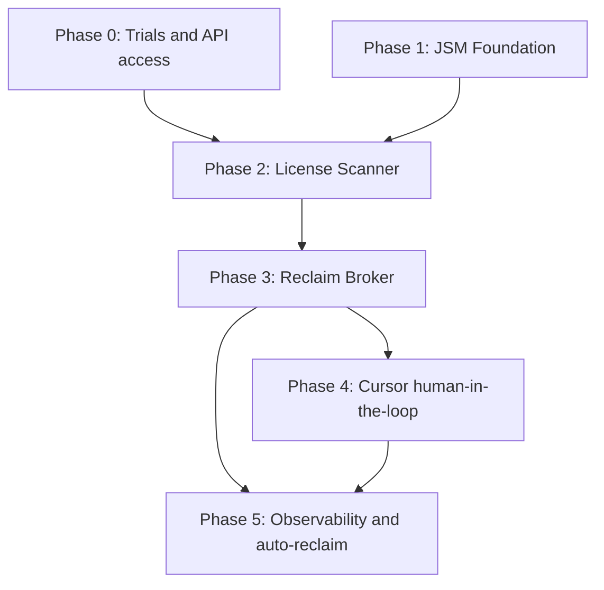

# License Reclamation — Human-in-the-Loop Product Roadmap

Product roadmap for reclaiming SaaS seats after offboarding when apps are **not SCIM-provisioned**. A deterministic **License Scanner Lambda** inventories GitHub, Figma, and Jira after Okta deactivation; findings land in **Jira Service Management (JSM)**. An IT-Ops agent uses **Cursor / Claude Code** (read ticket → call reclaim broker) so writes stay allowlisted and auditable. Email is failure-only; Slack remains same-day visibility.

**Architecture variant:** Deterministic scan + ticket + human-gated reclaim. Optional LLM orchestration for decision support; **broker Lambda is the only write path** to SaaS admin APIs. The agent never holds raw revoke credentials.

Companion to:

- [11-aws-scheduled-offboarding-workflow.md](11-aws-scheduled-offboarding-workflow.md) — EventBridge → Okta deactivate (trigger upstream)
- [07-end-to-end-leaver-demo.md](07-end-to-end-leaver-demo.md) — manual leaver CLI
- [13-access-review-broker-agent-prd.md](13-access-review-broker-agent-prd.md) — same agent-read / broker-write pattern (mirror for *grants*)
- [12-grc-jml-audit-access.md](12-grc-jml-audit-access.md) — GRC read of audit tables
- Dashboard collectors in `dashboard/` — license seat inventory UI (extend for reclaim findings)

---


## Problem statement

Okta deactivation + SCIM covers Slack and GWS for federated users. NovaTech also runs **non-SCIM** SaaS (GitHub, Figma, Jira product seats) where orphaned memberships keep consuming paid seats after a leaver’s last day.

Today that gap is console clicks and tribal memory. NovaTech needs:

1. **Automatic discovery** of active seats right after offboarding
2. **A durable work queue** for IT-Ops (JSM), not email threads
3. **Human judgment** before destructive revoke (shared seats, legal hold, contractor exceptions)
4. **API-driven reclaim** with least privilege and a three-way audit trail
5. **Optional AI copilot** so agents reclaim from a ticket prompt without holding god-mode admin keys

This mirrors Corporate Engineering / Business Technology expectations: API automation across SaaS, ITSM handoff, IaC, least-privilege security workflows, and AI as decision support — not autonomous write authority.

---


## Goals


| Goal                                    | Success metric                                                                                        |
| --------------------------------------- | ----------------------------------------------------------------------------------------------------- |
| Scan after every successful offboarding | 100% of deactivated leavers get a scan attempt within the same run window                             |
| Ticket when seats remain                | JSM **License Reclamation** issue opened when ≥1 app reports active seat                              |
| Human gate before revoke                | Zero SaaS revoke without ticket acknowledgment (status or explicit agent prompt)                      |
| Broker-only writes                      | Cursor/Claude never calls GitHub/Figma/Jira admin APIs with write tokens directly                     |
| Audit correlation                       | `correlation_id = JIRA-{issue_key}` (or `OFFBOARD-{run_id}` if clean) in DynamoDB + CloudWatch + Jira |
| Expand app catalog                      | Adding a fourth app = connector + allowlist entry, not a rewrite                                      |


---


## Non-goals (v1)

- Fully autonomous revoke with no human in the loop
- SCIM enablement for GitHub / Figma / Jira (out of band; this roadmap covers API reclaim)
- JSM portal / request-type configuration via MCP or Terraform (UI-first in JSM Admin)
- LLM direct SaaS admin writes
- Replacing Okta offboarding Lambda (scanner is downstream of doc 11)
- Tines / Okta Workflows orchestration (Lambda preferred for this sandbox)
- Billing reconciliation against vendor invoices

---


## Personas


| Persona                               | Role                    | Interaction                                       |
| ------------------------------------- | ----------------------- | ------------------------------------------------- |
| **Leaver**                            | Departing employee      | No interaction; subject of scan                   |
| **IT-Ops agent (human)**              | Service desk            | Owns JSM queue; prompts Cursor/Claude to reclaim  |
| **License Scanner (machine)**         | Deterministic inventory | Lambda: read SaaS APIs → JSM + Slack + DynamoDB   |
| **Reclaim broker (machine)**          | Write executor          | Lambda: allowlisted revoke only                   |
| **AI copilot (Cursor / Claude Code)** | Orchestration assist    | Reads JSM via MCP; calls broker; comments results |
| **GRC analyst**                       | Audit consumer          | DynamoDB / dashboard read of reclaim outcomes     |


---


## Target architecture

```
┌─────────────────────────────────────────────────────────────────────────────┐
│  EventBridge 5pm PT                                                          │
│       │                                                                      │
│       ▼                                                                      │
│  Offboarding Lambda (doc 11)                                                 │
│       │  Okta session revoke + deactivate                                    │
│       │  DynamoDB ohmgym-offboarding-logs                                    │
│       │  Slack #leaver-it-ops                                                │
│       ▼                                                                      │
│  emit leaver.completed  (user email, okta_id, run_id, run_date)              │
│       │                                                                      │
│       ▼                                                                      │
│  License Scanner Lambda  (deterministic, read-only secrets)                  │
│       │  GitHub: org membership?                                             │
│       │  Figma: team member / seat?                                          │
│       │  Jira: account / product access?                                     │
│       │                                                                      │
│       ├─ no active seats  → DynamoDB clean row + Slack footnote              │
│       └─ active seats     → create JSM "License Reclamation" ticket          │
│                              + Slack #leaver-it-ops summary                  │
│                              + DynamoDB findings                             │
│                                                                              │
│  ─── human-in-the-loop ───                                                   │
│                                                                              │
│  IT-Ops opens JSM ticket                                                     │
│       │                                                                      │
│       ▼                                                                      │
│  Prompt Cursor / Claude Code                                                 │
│       │  Jira MCP: read ITSD-nnn (user, apps[], correlation_id)             │
│       │  Confirm plan (skip / hold / reclaim)                                │
│       │  POST /v1/licenses/reclaim  → Reclaim Broker Lambda                  │
│       │  Jira MCP: comment results + transition Done                         │
│       ▼                                                                      │
│  Reclaim Broker                                                              │
│       │  Allowlist: config/licenses/apps.json                                │
│       │  Validate ticket key + user match scan findings                      │
│       │  Scoped write secrets (separate from scanner read keys)              │
│       ▼                                                                      │
│  GitHub / Figma / Jira admin APIs                                            │
│       ▼                                                                      │
│  Observability: Jira comment + DynamoDB + CloudWatch JSON                    │
└─────────────────────────────────────────────────────────────────────────────┘
```


### Deterministic vs agentic (roadmap stance)


| Layer          | v1 choice                                             | Why                                                                 |
| -------------- | ----------------------------------------------------- | ------------------------------------------------------------------- |
| Discovery      | **Deterministic** scanner Lambda                      | Fixed app list; reliable; cheap; matches JD “API-driven automation” |
| Work queue     | **JSM ticket**                                        | Durable ITSM handoff; not email                                     |
| Decision       | **Human** (+ optional LLM assist)                     | Shared seats, holds, exceptions                                     |
| Actuation      | **Deterministic broker**                              | Allowlist + least privilege; agent never holds write keys           |
| Future agentic | Optional orchestrator that emits a `ReclaimPlan` JSON | Only after broker exists; still no LLM-held write tokens            |


---


## Architectural decisions (ADRs)


| ID      | Decision                                                                        | Rationale                                                                                 |
| ------- | ------------------------------------------------------------------------------- | ----------------------------------------------------------------------------------------- |
| ADR-001 | Scanner is a separate Lambda from offboarding                                   | Failure of reclaim inventory must not block Okta deactivate; separate IAM + secrets       |
| ADR-002 | Trigger via EventBridge custom event / async invoke after successful deactivate | Loose coupling; replayable per user                                                       |
| ADR-003 | JSM ticket is source of truth for manual reclaim work                           | Matches Freshservice/JSM mental model on Corporate Engineering JDs; email is failure-only |
| ADR-004 | Keep Slack `#leaver-it-ops` for visibility                                      | Same ops channel as doc 11; not the work queue                                            |
| ADR-005 | Broker is the only SaaS write path                                              | Same security posture as access-review broker (doc 13)                                    |
| ADR-006 | Read secrets ≠ write secrets                                                    | Scanner starts read-only; expand write via separate Secrets Manager ARNs                  |
| ADR-007 | JSM Admin configured in UI                                                      | Atlassian MCP cannot configure request types / portal (see MCP boundaries)                |
| ADR-008 | Start with GitHub, Figma, Jira                                                  | Non-SCIM, free/trial friendly, clear seat semantics                                       |
| ADR-009 | Autoreclaim is opt-in per app later                                             | Human-in-the-loop first; auto-revoke only for apps marked `auto_reclaim: true`            |


---


## Data model


### Scanner findings (DynamoDB `ohmgym-license-reclaim-logs`)


| Attribute           | Notes                                                     |
| ------------------- | --------------------------------------------------------- |
| `pk`                | `run_date` (PT) or `OFFBOARD-{run_id}`                    |
| `sk`                | `user_id` or email                                        |
| `login` / `okta_id` | Identity snapshot                                         |
| `apps`              | List of `{ app, status, seat_type, action_hint, error? }` |
| `jira_issue_key`    | Set when ticket created                                   |
| `status`            | `clean` | `ticketed` | `reclaimed` | `partial` | `error`  |
| `correlation_id`    | `JIRA-…` or `OFFBOARD-…`                                  |
| `ttl_epoch`         | 90 days                                                   |


### JSM request type: **License Reclamation**

Configured in JSM Admin (not MCP). Suggested fields:


| Field                  | Type                           | Purpose              |
| ---------------------- | ------------------------------ | -------------------- |
| Leaver email           | Text                           | Primary subject      |
| Okta user ID           | Text                           | Stable ID for broker |
| Offboarding run ID     | Text                           | Link to doc 11 audit |
| Apps requiring action  | Multi-select / paragraph table | From scanner         |
| Hold / exception notes | Paragraph                      | Human judgment       |


### App allowlist (`config/licenses/apps.json`)

```json
{
  "github": {
    "label": "GitHub",
    "enabled": true,
    "auto_reclaim": false,
    "read_secret": "ohmgym-licenses/github-read",
    "write_secret": "ohmgym-licenses/github-write",
    "actions": ["remove_org_member"]
  },
  "figma": {
    "label": "Figma",
    "enabled": true,
    "auto_reclaim": false,
    "read_secret": "ohmgym-licenses/figma-read",
    "write_secret": "ohmgym-licenses/figma-write",
    "actions": ["remove_team_member"]
  },
  "jira": {
    "label": "Jira / Atlassian",
    "enabled": true,
    "auto_reclaim": false,
    "read_secret": "ohmgym-licenses/jira-read",
    "write_secret": "ohmgym-licenses/jira-write",
    "actions": ["remove_product_access", "deactivate_user"]
  }
}
```


### Broker API (planned)

`POST /v1/licenses/reclaim`

```json
{
  "issue_key": "ITSD-42",
  "user_email": "marcus.reyes@ohmgym.com",
  "okta_user_id": "00u…",
  "apps": ["github", "figma"],
  "dry_run": false,
  "requested_by": "chris@ohmgym.com"
}
```

Broker validates: apps ⊆ allowlist, findings exist for user, ticket not already fully reclaimed, secrets present. Rejects unknown apps with HTTP 400.

---


## MCP / tool boundaries


| Tool                | Read                                | Write                 | Phase |
| ------------------- | ----------------------------------- | --------------------- | ----- |
| **Atlassian MCP**   | JSM ticket fields, JQL              | Comments, transitions | 1, 4  |
| **Okta MCP / API**  | User profile (optional cross-check) | ❌ None for reclaim    | 2+    |
| **License Scanner** | SaaS membership APIs                | Create JSM issue only | 2     |
| **Reclaim Broker**  | Ticket + findings validation        | SaaS revoke APIs      | 3–4   |
| **Cursor / Claude** | Ticket + plan                       | Calls broker only     | 4     |


**JSM Admin (project, request type, portal, queues):** not available via MCP — manual UI in Phase 1.

---


## Phase roadmap


### Phase 0 — Trials & credentials

**Objective:** Stand up GitHub, Figma, and Jira trial/sandbox tenants with API access and SSO where available. No automation yet.


| ID    | Requirement                                                                              |
| ----- | ---------------------------------------------------------------------------------------- |
| P0-R1 | GitHub org (or Team trial); PAT/GitHub App with **read:org** / membership scope for scan |
| P0-R2 | Figma team / org trial; admin token capable of listing members                           |
| P0-R3 | Existing Jira/JSM site; API token for issue create + user/product lookups                |
| P0-R4 | Document OIN / SSO notes per app (even if SAML gated on paid tier)                       |
| P0-R5 | Seed 2–3 test users mirrored to Okta leavers for demos                                   |


**Exit criteria:** Manual curl/Python can answer “is user X a member?” for all three apps.

---


### Phase 1 — JSM foundation

**Objective:** License Reclamation request type exists. Field IDs documented. MCP can read a test ticket.


| ID    | Requirement                                                                      |
| ----- | -------------------------------------------------------------------------------- |
| P1-R1 | JSM project (or reuse ITSD) with **License Reclamation** request type            |
| P1-R2 | Portal/agent fields: leaver email, Okta ID, run ID, apps list, notes             |
| P1-R3 | Queue for IT-Ops; SLA optional                                                   |
| P1-R4 | `JIRA_*` credentials in `.env` / Secrets Manager                                 |
| P1-R5 | `config/jira/field-mapping.json` includes reclaim fields (extend doc 13 mapping) |
| P1-R6 | One manually created sample ticket; Atlassian MCP reads custom fields            |


**Exit criteria:**

- [ ] Request type visible to agents
- [ ] Field IDs committed for automation
- [ ] MCP `getJiraIssue` returns structured reclaim fields

**Deliverables:**

```
config/jira/field-mapping.json   # extended
config/licenses/apps.json        # stub allowlist
```

---


### Phase 2 — Deterministic License Scanner Lambda

**Objective:** After offboarding success, scan GitHub / Figma / Jira (read-only). Ticket + Slack + DynamoDB when seats remain.


| ID     | Requirement                                                                                                             |
| ------ | ----------------------------------------------------------------------------------------------------------------------- |
| P2-R1  | Terraform stack `terraform/aws-license-reclaim/` (or module under offboarding)                                          |
| P2-R2  | EventBridge rule / async invoke on `leaver.completed` (or chained invoke from offboarding with clear failure isolation) |
| P2-R3  | Connectors: `scripts/licenses/{github,figma,jira}_client.py`                                                            |
| P2-R4  | Read-only secrets in Secrets Manager; IAM grants GetSecretValue on read ARNs only                                       |
| P2-R5  | If any `status=active` → create JSM issue via Service Desk / issue API                                                  |
| P2-R6  | Always write DynamoDB findings row; Slack summary to `#leaver-it-ops`                                                   |
| P2-R7  | Idempotent: same `(run_date, user_id)` does not open duplicate tickets                                                  |
| P2-R8  | `--dry-run` / `dry_run` event flag prints plan without Jira create                                                      |
| P2-R9  | Unit tests with mocked HTTP for all three connectors                                                                    |
| P2-R10 | Extend dashboard or workflows UI to show reclaim findings (optional same phase)                                         |


**Exit criteria:**

- [ ] Deactivate test leaver → scanner runs → ticket lists exact apps with active seats
- [ ] Clean user (no seats) → `status=clean`, no ticket
- [ ] Forced API failure → DynamoDB `error` + CloudWatch alarm path (SNS email OK)

**Deliverables:**

```
lambdas/license_scanner/handler.py
scripts/licenses/
config/licenses/apps.json
terraform/aws-license-reclaim/
tests/unit/test_license_scanner.py
```

---


### Phase 3 — Reclaim Broker (deterministic writes)

**Objective:** Allowlisted revoke API. Dry-run default. No Cursor required yet — `curl` / CLI proves the path.


| ID    | Requirement                                                                                 |
| ----- | ------------------------------------------------------------------------------------------- |
| P3-R1 | `POST /v1/licenses/reclaim` on Lambda Function URL (mirror access broker)                   |
| P3-R2 | Separate write secrets; scanner role cannot read them                                       |
| P3-R3 | Reject apps not in findings for that user / not on allowlist                                |
| P3-R4 | Per-app actions: GitHub remove member; Figma remove member; Jira remove access / deactivate |
| P3-R5 | Idempotent reclaim; partial success recorded per app                                        |
| P3-R6 | Webhook / Function URL auth (shared secret or signed header)                                |
| P3-R7 | CLI: `scripts/licenses/reclaim.py --issue ITSD-42 --dry-run`                                |
| P3-R8 | On success, update DynamoDB + optional Jira comment from broker                             |


**Exit criteria:**

- [ ] Dry-run shows accurate plan
- [ ] Live reclaim removes GitHub membership for test user; ticket commentable via CLI
- [ ] Unknown app key → 400, no SaaS call

**Deliverables:**

```
lambdas/license_reclaim_broker/handler.py
scripts/licenses/reclaim.py
terraform/aws-license-reclaim/ (broker + write IAM)
```

---


### Phase 4 — Human-in-the-loop Cursor / Claude skill

**Objective:** Service desk agent prompts Cursor/Claude from the ticket; copilot reads JSM, calls broker, comments and transitions.


| ID    | Requirement                                                                    |
| ----- | ------------------------------------------------------------------------------ |
| P4-R1 | Cursor skill / Claude skill: “Reclaim licenses for ticket {key}”               |
| P4-R2 | Skill uses Atlassian MCP to load ticket; never invents user/apps               |
| P4-R3 | Skill proposes plan; waits for human confirm in chat for destructive calls     |
| P4-R4 | Skill calls broker with `issue_key` + allowlisted apps only                    |
| P4-R5 | On broker response: comment per-app results; transition to Done when all clear |
| P4-R6 | Runbook in `docs/` or skill description: example prompts + failure handling    |
| P4-R7 | Negative test: prompt to reclaim user **not** on ticket → broker/skill refuse  |


**Example agent prompt:**

> Pull ITSD-42. For the leaver on the ticket, reclaim GitHub and Figma via the license broker. Skip Jira. Comment results and set Done if both succeed.

**Exit criteria:**

- [ ] End-to-end: offboard → scan ticket → Cursor reclaim → seats gone → ticket Done
- [ ] Broker logs show `requested_by` = agent identity / operator email
- [ ] No write tokens in Cursor env — only broker URL + webhook secret

---


### Phase 5 — Observability, GRC, and selective auto-reclaim

**Objective:** Audit queries, dashboards, and optional `auto_reclaim: true` for lowest-risk apps.


| ID    | Requirement                                                                                                              |
| ----- | ------------------------------------------------------------------------------------------------------------------------ |
| P5-R1 | GRC read access to `ohmgym-license-reclaim-logs` (extend doc 12 pattern)                                                 |
| P5-R2 | Dashboard card: open reclaim tickets / seats recovered this month                                                        |
| P5-R3 | Weekly report script: ticketed vs reclaimed vs aged SLA                                                                  |
| P5-R4 | Optional: for apps with `auto_reclaim: true`, broker runs without Cursor after ticket create (still writes Jira comment) |
| P5-R5 | Stretch: Okta for AI Agents registration of scanner/broker NHIs (governance theater + revoke)                            |
| P5-R6 | Stretch: agentic planner that emits `ReclaimPlan` JSON consumed by the same broker                                       |


**Exit criteria:**

- [ ] GRC can query reclaim outcomes by date without IT-Ops credentials
- [ ] At least one app can demo auto-reclaim behind a feature flag
- [ ] Interview demo script under 10 minutes

---


## Phase dependency graph




Phases 0 and 1 can run in parallel. Phase 2 needs both. Phase 4 must not precede Phase 3 (no LLM write path without broker).

---


## Security requirements (all phases)


| Control            | Implementation                                                    |
| ------------------ | ----------------------------------------------------------------- |
| Least privilege    | Separate read vs write secrets; scoped GitHub/Figma/Jira tokens   |
| Allowlist          | `config/licenses/apps.json` — broker rejects unknown apps/actions |
| No LLM SaaS writes | Cursor → broker only                                              |
| Human gate (v1)    | Ticket exists; agent confirms plan before broker call             |
| Secrets            | AWS Secrets Manager; never commit tokens                          |
| IAM                | Scanner role cannot `GetSecretValue` on write ARNs                |
| Audit              | DynamoDB + Jira comment + CloudWatch `correlation_id`             |
| Idempotency        | Re-scan and re-reclaim safe                                       |
| Failure email      | SNS on Lambda Errors only (match doc 11)                          |


---


## Platform ownership


| Platform             | Tool                                         | Creates                          |
| -------------------- | -------------------------------------------- | -------------------------------- |
| **Okta offboarding** | Existing doc 11 stack                        | `leaver.completed` trigger       |
| **JSM**              | Admin UI                                     | License Reclamation request type |
| **Jira config**      | `config/jira/field-mapping.json`             | Field IDs                        |
| **App catalog**      | `config/licenses/apps.json`                  | Allowlist + secret names         |
| **Scanner**          | `lambdas/license_scanner` + Terraform        | Inventory + ticket create        |
| **Broker**           | `lambdas/license_reclaim_broker` + Terraform | Revoke API                       |
| **Copilot**          | Cursor/Claude skill                          | Human-in-the-loop orchestration  |
| **Audit**            | DynamoDB + dashboard                         | Findings + outcomes              |


---


## Sandbox scope


| Item               | Sandbox choice                                                     |
| ------------------ | ------------------------------------------------------------------ |
| Apps               | GitHub, Figma, Jira (3 non-SCIM)                                   |
| Trigger            | Post–doc 11 offboarding success                                    |
| ITSM               | JSM trial (same site as access-review where possible)              |
| ChatOps            | Slack `#leaver-it-ops`                                             |
| AWS                | OhmGym account `882248517627`, `us-west-1`                         |
| AI                 | Cursor / Claude Code with Atlassian MCP; no Tines                  |
| Identity (stretch) | Okta API Services app today; Okta for AI Agents when SKU available |


---


## Repository structure (planned)

```
config/
  licenses/apps.json
  jira/field-mapping.json          # extended
  dashboard/license-limits.json    # optional seat caps for new apps
scripts/
  licenses/
    github_client.py
    figma_client.py
    jira_client.py
    reclaim.py
    scan_cli.py
lambdas/
  license_scanner/
    handler.py
  license_reclaim_broker/
    handler.py
terraform/
  aws-license-reclaim/
public-docs/
  16-license-reclamation-human-in-the-loop-roadmap.md
```

---


## Demo script (interview)

1. Set test user’s `profile.endDate` to today; wait for / invoke offboarding Lambda.
2. Show Okta deactivated + Slack `#leaver-it-ops` batch post.
3. Show scanner CloudWatch / DynamoDB findings for GitHub + Figma.
4. Open JSM License Reclamation ticket with structured app table.
5. In Cursor: run reclaim skill against ticket key (dry-run, then apply).
6. Show broker CloudWatch JSON + GitHub membership gone.
7. Ticket comment + Done; dashboard/audit query by `correlation_id`.

Framing line:

> "SCIM covered Slack and GWS, but GitHub, Figma, and Jira seats were still orphaned after offboarding. I built a deterministic scanner Lambda that opens a JSM ticket, then a least-privilege reclaim broker so an IT agent can prompt Cursor to finish the work — the model never holds the revoke keys. Same agent-read / broker-write pattern I used for access grants."

Maps to JD themes: offboarding automation, API-driven SaaS integrations, ITSM (Jira/Freshservice-class), least privilege + audit, Terraform/IaC, practical AI for operational workflows.

---


## Open questions


| #   | Question                                            | Default for sandbox                                                  |
| --- | --------------------------------------------------- | -------------------------------------------------------------------- |
| 1   | Invoke scanner in-process vs EventBridge bus event? | Async EventBridge custom event for isolation                         |
| 2   | Create customer request vs agent issue API?         | Agent-side issue create with request-type field if portal not needed |
| 3   | Auto-reclaim GitHub in Phase 5?                     | Yes candidate (`auto_reclaim: true`); keep Figma/Jira human-gated    |
| 4   | Shared JSM project with access-review or separate?  | Same site; separate request type                                     |
| 5   | Register NHIs in Okta for AI Agents?                | Stretch after API Services app works                                 |


---


## Related docs index


| Doc                                            | Relationship                                                       |
| ---------------------------------------------- | ------------------------------------------------------------------ |
| [11](11-aws-scheduled-offboarding-workflow.md) | Upstream deactivate trigger                                        |
| [13](13-access-review-broker-agent-prd.md)     | Parallel pattern for *grants*; reuse Jira field-mapping discipline |
| [08](08-okta-event-hook-lambda.md)             | Lambda + Secrets Manager reference                                 |
| [12](12-grc-jml-audit-access.md)               | Extend for reclaim audit reads                                     |
| [15](15-aws-account-migration-plan.md)         | Target AWS account for new stack                                   |


